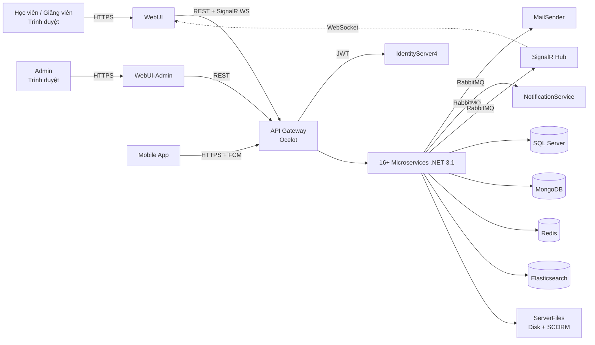
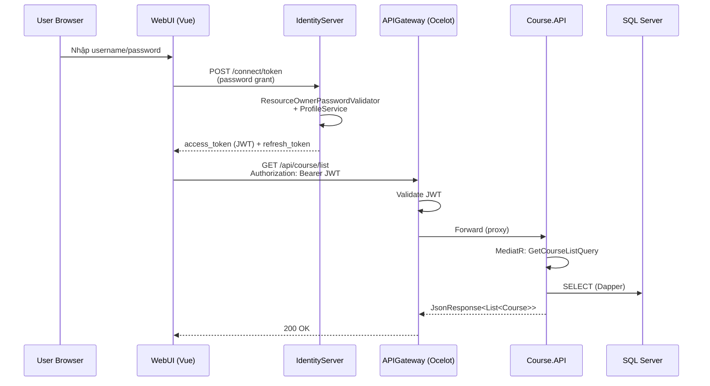
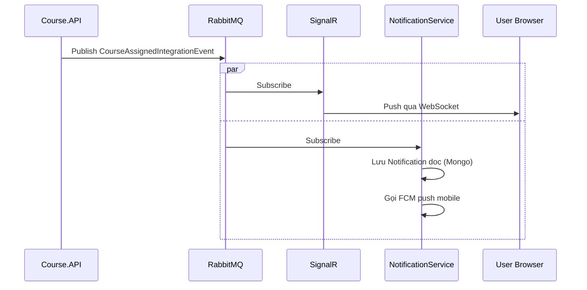
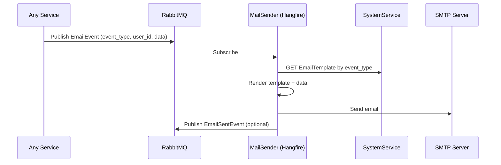

# 01 — Tổng quan hệ thống (System Overview)

> Đây là điểm vào của bộ tài liệu CLS 4.0. Đọc file này để có cái nhìn toàn cảnh, sau đó tra cứu chi tiết ở các file `02..07`.

## 1. Tóm lược sản phẩm

**CLS 4.0** là hệ thống Learning Management System (LMS) phục vụ đào tạo doanh nghiệp với các tính năng cốt lõi:

- Quản lý khoá học và nội dung học (SCORM/video/PDF/essay/offline).
- Ngân hàng câu hỏi, đề thi, ca thi, chấm điểm tự động + chấm tay.
- Lộ trình học (Training Route) tuần tự + Training Plan tổng thể.
- Khảo sát (Survey), chứng chỉ (Certification), gift/reward gamification.
- Báo cáo đa chiều (user/course/exam/lecturer/cost) + custom report.
- Realtime: chat, notification, giám sát thi (anti-cheat).
- **Multi-tenant theo Portal** — một deployment phục vụ nhiều khách hàng/đơn vị, mỗi đơn vị có Portal riêng với theme, domain, feature toggle riêng.

Production domains hiện tại: `lmsapi.doffice.com.vn`, `lmsadmin.doffice.com.vn`, `lmssignal.doffice.com.vn`, `lmssf.doffice.com.vn`.

## 2. Personas (đối tượng người dùng)

| Persona | Mô tả | Truy cập |
|---|---|---|
| **Học viên** | Người tham gia học, làm bài thi, nhận chứng chỉ. | WebUI |
| **Giảng viên** | Tạo nội dung khoá học, chấm essay, theo dõi lớp. | WebUI (với role) |
| **Portal Admin** | Quản trị 1 portal: user, khoá học, báo cáo nội bộ. | WebUI hoặc WebUI-Admin tuỳ feature |
| **Super Admin** | Quản trị cấp Management, tạo Portal, cấu hình feature toàn hệ thống. | WebUI-Admin |
| **HR** | Vận hành tuyển dụng/lương — tích hợp HR có sẵn trong UserService. | WebUI |
| **Hệ thống** | Background job (mail sender, FCM push, scheduled report). | Internal |

## 3. Bản đồ kiến trúc

### 3.1 C4 — Context



### 3.2 Container — danh sách service runtime

| # | Service | Vai trò chính | Port nội bộ |
|---|---|---|---|
| 1 | **IdentityServer** | OAuth2/OIDC, cấp JWT, social login | (qua Gateway) |
| 2 | **APIGateway (Ocelot)** | Route + JWT middleware + Swagger aggregation | `lmsapi:8080` |
| 3 | **UserService** | User/Portal/Group/Org/HR/Address/Role | internal |
| 4 | **CourseService** | Khoá học + nội dung + enrollment + plan | 8012 |
| 5 | **QuestionService** | Ngân hàng câu hỏi + đề thi + ca thi + chấm điểm | internal |
| 6 | **SharedServices** | Article/Library/Certification/Gift/Theme | internal |
| 7 | **SystemService** | EmailTemplate/NotificationConfig/Widget/Custom Report | internal |
| 8 | **TrainingRouteService** | Lộ trình học + LearningStep | internal |
| 9 | **SignalR** | Hub realtime (notification/chat/exam) — Redis backplane | `lmssignal:8015` |
| 10 | **CommunicationService** | Chat store + test log + exam log (Mongo) | internal |
| 11 | **NotificationService** | Mobile FCM push | internal |
| 12 | **LogService** | System activity / violate user / audit (Mongo) | internal |
| 13 | **ServerFiles** | Upload + SCORM serve + file transfer | `lmssf:8021` |
| 14 | **MailSender** | Hangfire background gửi mail | internal |
| 15 | **ReportService** | Báo cáo tổng hợp | internal |
| 16 | **Admin (Internal Gateway)** | Cổng riêng cho admin | `lmsadmin:8089` |

Ngoài ra: **CLS4.0-Core** là shared library (NuGet/internal package) cung cấp `IEventBus`, `Repository<T>`, JWT middleware, Consul loader, MediatR Behaviors... được tất cả service tham chiếu.

## 4. Kiến trúc trong một service

Mỗi service tuân theo cấu trúc thư mục:

```
<Service>.API/            <- entry, controller, DI module, AutoMapper profile
  Controllers/
  Application/<Module>/
    Commands/{Name}Command.cs + Handlers/{Name}Handler.cs
    Queries/{Name}Query.cs   (Dapper) / {Name}MongoQuery.cs (Mongo)
    Models/                 <- DTO, IntegrationEvent
    Validators/             <- FluentValidation
  AutofacModules/
<Service>.Domain/         <- thuần nghiệp vụ, không reference framework
  Models/                 <- Aggregate, Entity, Enum
  Queries/                <- interface QueryBase
  SeedWork/               <- IRepository, IUnitOfWork
<Service>.Infrastructure/ <- EF Core, Dapper, Mongo, Repository impl
  Repositories/
  Queries/
  EntityConfigurations/   <- IEntityTypeConfiguration<T>
  Migrations/             <- EF migration snapshot
  IntegrationEvents/      <- Handler subscribe RabbitMQ
Tests/
```

Pattern xử lý request:

```
HTTP Request
  -> Controller (mỏng, gọi ExecuteCommand từ CustomController base)
  -> MediatR Dispatcher
  -> [Pipeline Behavior: Logging -> Validation (FluentValidation) -> Transaction]
  -> Command Handler / Query Handler
  -> Repository (EF Core)  hoặc  Query (Dapper/Mongo)
  -> Domain rule + DbContext.SaveChanges
  -> Publish Integration Event (nếu có) qua IEventBus
  -> Trả về JsonResponse<T>
```

## 5. Cross-cutting concerns

| Concern | Implementation |
|---|---|
| **Authentication** | IdentityServer4 cấp JWT; mỗi service validate qua JWT Bearer middleware. JWT chứa user id, portal id, role, feature. |
| **Authorization** | Role-based + Feature-based (mỗi Portal có danh sách Feature bật/tắt). Filter trong Controller hoặc check trong Handler. |
| **Configuration** | `appsettings.{env}.json` load từ Consul KV qua `Winton.Extensions.Configuration.Consul`. Env var `CONSULHOST` chỉ tới Consul cluster. ReloadOnChange = true. |
| **Service Discovery** | `Steeltoe.Discovery.Eureka` — service tự register vào Eureka khi start. |
| **Event Bus** | `IEventBus` (CLS4.0-Core) trên RabbitMQ. Broker `micro_event_bus`. Có retry Polly + dynamic event handler. |
| **Logging** | Serilog enrich với CorrelationId + UserId; production có sink Elasticsearch. |
| **Healthcheck** | `AspNetCore.HealthChecks` mở endpoint `/hc` cho K8s liveness/readiness. |
| **Background Job** | Hangfire (MailSender + một số service có schedule). |
| **Realtime** | SignalR Hub + Redis Backplane (`Redis:Host`). Frontend dùng `@microsoft/signalr` client. |
| **Validation** | FluentValidation + MediatR pipeline behavior. |
| **API docs** | Swashbuckle Swagger UI; APIGateway aggregate Swagger từ tất cả service. |

## 6. Luồng dữ liệu mẫu

### 6.1 Login + gọi API



### 6.2 Sự kiện realtime — Notification



### 6.3 Background mail



## 7. Stack công nghệ tóm lược

| Lớp | Công nghệ |
|---|---|
| Frontend | Vue 2.6, Vuex 3, Vue Router 3, Axios, Bootstrap-Vue, @microsoft/signalr, Firebase Messaging, MSAL |
| Backend runtime | .NET Core 3.1 (`netcoreapp3.1`) |
| Web framework | ASP.NET Core Web API |
| DI | Autofac |
| ORM/Query | EF Core 3.1 + Dapper + MongoDB.Driver |
| Mediator | MediatR |
| Auth | IdentityServer4 + JWT Bearer |
| Gateway | Ocelot |
| Event Bus | RabbitMQ (custom EventBus trong CLS4.0-Core) |
| Service Discovery | Steeltoe.Discovery.Eureka |
| Config Server | Consul KV (`Winton.Extensions.Configuration.Consul`) |
| Realtime | SignalR + Redis backplane |
| Logging | Serilog + Elasticsearch sink |
| Background Job | Hangfire |
| Container | Docker multi-stage |
| Orchestration | Kubernetes (NGINX Ingress) |
| CI/CD | GitLab CI |
| DB Transactional | SQL Server |
| DB NoSQL | MongoDB |
| Cache/Pub-Sub | Redis |

## 8. Dẫn link sang các tài liệu chi tiết

| File | Nội dung |
|---|---|
| [02-backend-feature-catalog.md](02-backend-feature-catalog.md) | Catalog toàn bộ tính năng backend theo từng service |
| [services/README.md](services/README.md) | **Deep-dive per-service** (16 file chi tiết use case, validator, business rule) |
| [03-frontend-feature-catalog.md](03-frontend-feature-catalog.md) | Catalog tính năng WebUI + WebUI-Admin |
| [04-database-schema.md](04-database-schema.md) | Schema SQL Server + MongoDB chi tiết |
| [05-deployment-operations.md](05-deployment-operations.md) | K8s topology, support component, CI/CD, runbook |
| [06-glossary.md](06-glossary.md) | Thuật ngữ nghiệp vụ + kỹ thuật |
| [07-rust-migration-plan.md](07-rust-migration-plan.md) | Kế hoạch migrate backend sang Rust (Phần 2) |
| [technical-design.md](technical-design.md) | Tài liệu khung kỹ thuật ban đầu (giữ làm reference) |
