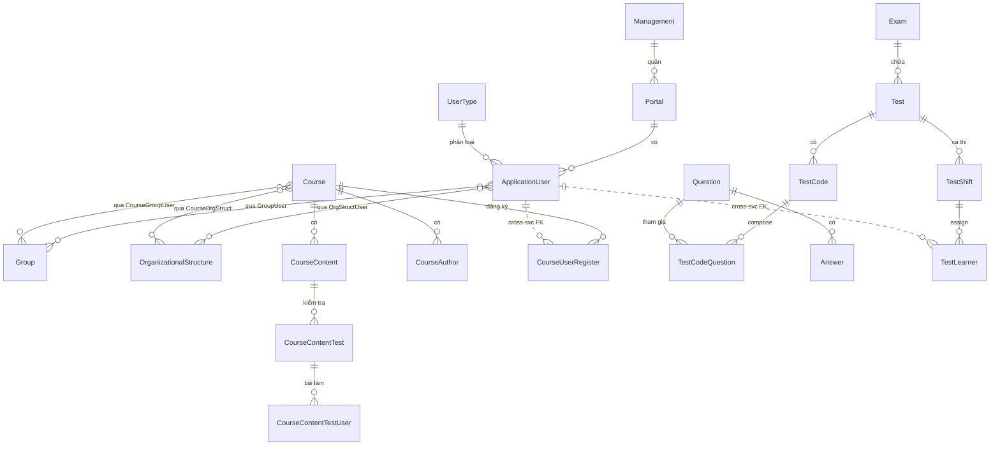
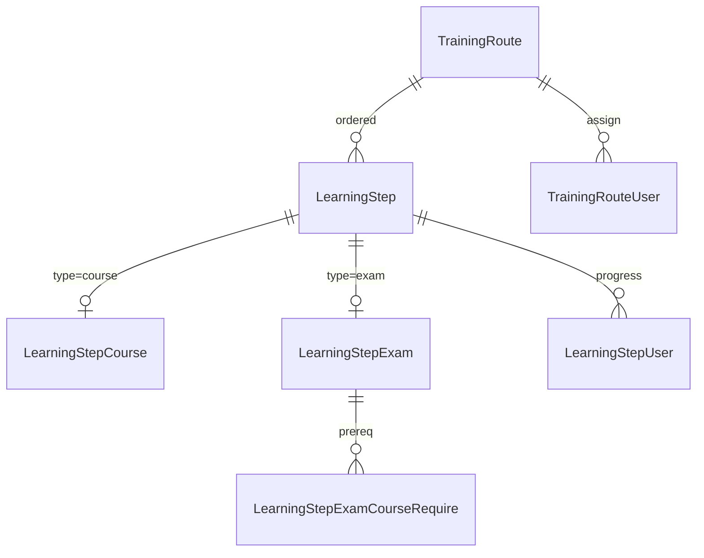
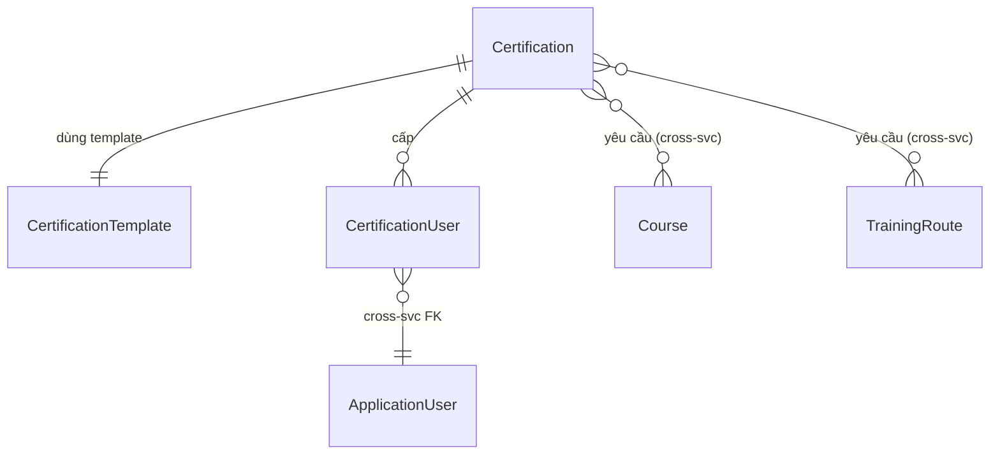

# 04 — Database Schema

> Schema chi tiết theo từng service. Mỗi service có SQL Server DB riêng (polyglot persistence + bounded context). Một số service còn dùng MongoDB cho data NoSQL.
>
> Nguồn truth: EF Core migration snapshot (`*.Infrastructure/Migrations/ApplicationDbContextModelSnapshot.cs`). File này tổng hợp/giản hoá; khi nghi ngờ → đọc snapshot.

## 1. Tổng quan polyglot persistence

| Loại | Engine | Service dùng |
|---|---|---|
| Transactional | **SQL Server** | UserService, CourseService, QuestionService, SharedServices, SystemService, TrainingRouteService, ServerFiles, IdentityServer |
| NoSQL stream/log | **MongoDB** | CommunicationService, NotificationService, LogService |
| Cache + Pub/Sub | **Redis** | SignalR backplane, online user map |
| Full-text search & log | **Elasticsearch** | Serilog log sink |

Mỗi service .NET có riêng `ApplicationDbContext` (EF Core 3.1). Migration của service nào nằm trong service đó — **không có schema chia sẻ**.

## 2. UserService DB

**Số bảng (xấp xỉ)**: 64. **Migration snapshot**: `CLS4.0-UserService/src/User.Infrastructure/Migrations/ApplicationDbContextModelSnapshot.cs`.

### 2.1 Aggregate chính + bảng

| Aggregate | Bảng | Ý nghĩa |
|---|---|---|
| User | `ApplicationUser` | User chính, có `PortalId`, `UserTypeId` |
|   | `LoginHistory` | Lịch sử đăng nhập |
|   | `SuperAdmin` | Cờ super-admin (cross-portal) |
|   | `TimeZone` | TZ của user |
|   | `EducationUser` | Học vấn từng user (FK Degree, School) |
|   | `ExperienceUser` | Kinh nghiệm làm việc |
| UserType / Role | `UserType` | Loại user (Học viên/Giảng viên/Admin) |
|   | `DefaultRole` | Role mặc định theo UserType |
|   | `Permission` | Permission theo role |
|   | `UserTypeFeature` | Feature gán cho UserType |
| Group | `Group`, `GroupUser` | Nhóm user + map |
|   | `GroupCourse`, `GroupExamination`, `GroupTrainingProgram` | Map group ↔ asset |
| OrganizationalStructure | `OrganizationalStructure` (cây phòng ban) | Adjacency list (`ParentId`) |
|   | `OrganizationalStructureUser` | Map user ↔ phòng ban |
|   | `OrganizationalStructureCourse`, `OrganizationalStructureExamination`, `OrganizationalStructureTrainingProgram` | Map phòng ban ↔ asset |
| Management/Portal | `Management` | Đơn vị quản trị cấp trên |
|   | `Portal` | Cổng tenant (có `Domain`, `Theme`, `ManagementId`) |
|   | `ManagementUser` | Admin của Management |
|   | `Domain` | Cấu hình domain alias |
|   | `Branch` | Chi nhánh thuộc Portal |
|   | `Credit` | Credit/wallet cấp Portal |
| Feature | `Feature` (per-portal toggle) | Bật/tắt theo Portal |
|   | `FeatureGroup` | Nhóm feature |
|   | `FeatureDefault` | Default feature theo UserType |
| Customer/Onboarding | `Customer` | Khách hàng onboarding |
|   | `RegistryConfiguration` | Cấu hình tự đăng ký |
| Address | `Country`, `Province`, `District`, `Ward` | 4 cấp địa chỉ |
| Title/Proficiency | `Title`, `CategoryTitle` | Chức danh + nhóm |
|   | `Proficiency`, `ProficiencyLevel`, `GroupProficiency` | Kỹ năng + cấp độ |
|   | `ProficiencyUser` | Skill của user |
|   | `ProficiencyLevelCourse`, `ProficiencyLevelMap`, `TitleProficiencyLevel` | Map skill ↔ course/title |
| HR | `Degree`, `AcademicDegree`, `AcademicRank` | Bằng cấp, học vị, học hàm |
|   | `Experience` (catalog) | Loại kinh nghiệm |
|   | `UserExperiencePoint` | Điểm kinh nghiệm user |
|   | `PayrollScale` | Bảng lương |
|   | `School`, `SchoolType` | Trường, loại trường |
| Calendar | `EventCalendar`, `EventCalendarUser`, `EventCalendarGroupUser`, `EventCalendarOrganizationalStructure` | Lịch + recipient |
| Activity | `ActivityUser` | Active/inactive |
|   | `FollowUser` | Theo dõi user |
|   | `Order` | Order/credit transaction |
| Auth bridging | `JwtLog` | Audit JWT token cấp ra (để revoke) |
| Topic | `TopicCourse`, `TopicCourseGroup`, `TopicCourseUser` | Topic mapping với group/user |

### 2.2 Quan hệ tiêu biểu

```
Management (1) -- (N) Portal -- (N) ApplicationUser
ApplicationUser (1) -- (N) GroupUser -- (N) Group
ApplicationUser (1) -- (N) OrganizationalStructureUser -- (N) OrganizationalStructure (self-ref ParentId)
ApplicationUser (1) -- (N) JwtLog
UserType (1) -- (N) ApplicationUser ; UserType (1) -- (N) UserTypeFeature -- (N) Feature
Portal (1) -- (N) Feature ; Portal (1) -- (N) Branch
Country -- Province -- District -- Ward (cascade)
```

### 2.3 Quan hệ N-N

| Bảng map | Liên kết |
|---|---|
| `GroupCourse` | Group ↔ Course (ID) |
| `OrganizationalStructureCourse` | OrgStruct ↔ Course |
| `EventCalendarUser` | EventCalendar ↔ User |
| `UserTypeFeature` | UserType ↔ Feature |
| `ProficiencyUser` | User ↔ Proficiency |
| `TitleProficiencyLevel` | Title ↔ ProficiencyLevel |

### 2.4 Index/unique quan trọng

- `ApplicationUser.Email` (per `PortalId`) — unique compound.
- `Portal.Domain` — unique global.
- `JwtLog.Jti` — unique để check revoke.
- `OrganizationalStructure.ParentId` — index cho tree query.

---

## 3. CourseService DB

**Số bảng (xấp xỉ)**: 44. **Snapshot**: `CLS4.0-CourseService/.../Course.Infrastructure/Migrations/...`.

### 3.1 Aggregate chính + bảng

| Aggregate | Bảng | Ý nghĩa |
|---|---|---|
| Course | `Course` | Aggregate root khoá học |
|   | `CourseContent` | Bài học trong khoá (SCORM/video/PDF/essay/quiz) |
|   | `CourseContentRequire` | Điều kiện qua content (xem hết, đạt điểm tối thiểu) |
|   | `CourseAuthor` | Giảng viên/tác giả khoá học |
|   | `CourseApprover` | Người duyệt khoá học |
|   | `CourseUserRegister` | Bản ghi đăng ký user vào khoá |
|   | `CourseAnonymousUser` | User ẩn danh (public course) |
|   | `CourseGroupUser` | Map khoá ↔ Group |
|   | `CourseOrganizationalStructure` | Map khoá ↔ OrgStruct |
|   | `CourseHomeOrganizationalStructure` | OrgStruct chính của khoá |
|   | `CourseBranch` | Map khoá ↔ Branch |
|   | `CourseHistory` | Lịch sử thay đổi khoá |
|   | `CourseLike` | Like khoá |
|   | `CourseRate` | Đánh giá sao + nhận xét |
| Learner | `CourseUser` | User join khoá (sau khi register approved) |
|   | `CourseContentUser` | Progress của user trong từng content |
|   | `CourseContentUserEssay` | Bài essay nộp |
|   | `CourseContentNote` | Ghi chú cá nhân |
|   | `CourseContentDiscuss` | Thảo luận trong content |
|   | `CourseComment`, `CourseCommentReaction` | Bình luận khoá học |
| Course request | `CourseRequest` | Yêu cầu đăng ký (chờ duyệt) |
| Course share | `CourseShare` | Khoá chia sẻ giữa portal |
| Cost | `Cost` | Chi phí khoá |
| ContentArchive | `ContentArchive`, `ContentArchiveType` | Kho content tái sử dụng |
| ContentRollCall | `ContentRollCall`, `ContentRollCallUser` | Điểm danh content offline |
| Participant | `Participant` | Người tham gia (tổng quát) |
| Plan | `Plan`, `PlanCourse`, `PlanCategoryTitleMap` | Training plan + map khoá vào plan |
| TrainingPlan | `TrainingPlan`, `TrainingProgram` | Plan lớn (program) |
| TrainingCategory | `TrainingCategory`, `TrainingType` | Phân loại |
| EvaluationCriteria | `CourseEvaluationCriteria`, `CourseEvaluationCriterionUser`, `CourseEvaluationUser` | Tiêu chí đánh giá end-of-course |
| Require | `CourseRequire`, `CourseCertificationRequire`, `CourseProficiencyRequire` | Điều kiện cần để đăng ký |

### 3.2 Quan hệ tiêu biểu

```
Course (1) -- (N) CourseContent -- (N) CourseContentUser
Course (1) -- (N) CourseAuthor (User from UserService — FK cross-service)
Course (1) -- (N) CourseUserRegister
Plan (1) -- (N) PlanCourse -- (1) Course
TrainingPlan (1) -- (N) Plan ?  (xác minh trong code nếu cần)
Course (N) -- (N) Group  qua  CourseGroupUser
Course (N) -- (N) OrgStruct  qua  CourseOrganizationalStructure
```

### 3.3 Index/unique

- `Course.Code` (per `PortalId`) — unique compound.
- `CourseUserRegister(CourseId, UserId)` — unique.
- `CourseContent.Order` — index để sort.

---

## 4. QuestionService DB

**Số bảng (xấp xỉ)**: 59. **Snapshot**: `CLS4.0-QuestionService/.../Question.Infrastructure/Migrations/...`.

### 4.1 Aggregate chính + bảng

| Aggregate | Bảng | Ý nghĩa |
|---|---|---|
| Question | `Question` | Câu hỏi (single/multi/essay/fill) |
|   | `QuestionLevel` | Độ khó |
| Answer | `Answer` | Đáp án (cờ đúng/sai cho question đáp án sẵn) |
| Exam | `Exam` | Kỳ thi (chứa nhiều Test) |
|   | `Test` | Bài thi cụ thể trong Exam |
|   | `TestCode` | Mã đề (compose từ Question, random per user) |
|   | `TestCodeQuestion`, `TestCodeQuestionAnswer` | Map Question + Answer vào TestCode |
|   | `TestCodeStructure` | Cấu trúc TestCode (số câu mỗi level) |
|   | `TestCodeShift` | Map TestCode ↔ Shift |
|   | `TestShift` | Ca thi (time window) |
|   | `TestLearner`, `TestLearnerMap` | Học viên trong Test |
|   | `TestGroupUser` | Group thi |
|   | `TestOrganizationalStructure` | OrgStruct thi |
|   | `TestTeacher` | Giảng viên ra đề |
|   | `TestSupervisor`, `TestSupervisorShift` | Giám thị |
| Course-level test (course content) | `CourseContentTest`, `CourseContentTestQuestion`, `CourseContentTestQuestionAnswer`, `CourseContentTestSupervision` | Test gắn vào CourseContent |
|   | `CourseContentTestUser`, `CourseContentTestUserQuestion`, `CourseContentTestUserQuestionAnswer`, `CourseContentTestUserQuestionEssay` | Bài làm + đáp án user + essay |
|   | `CourseExamRequired` | Điều kiện thi |
| Exam supervision | `Supervision`, `Chat` (in `ExamSupervision/`) | Giám sát + chat giám thị |
| Cost | `Cost` | Chi phí thi |
| Survey | `Survey` | Khảo sát aggregate root |
|   | `SurveyExam`, `SurveyTest`, `SurveyTestCode`, `SurveyTestCodeStructure` | Cấu trúc khảo sát theo exam/test/code |
|   | `SurveyChoice`, `SurveyCategoryRating`, `SurveyLevelRating` | Lựa chọn + rating |
|   | `SurveyTestGroupUser`, `SurveyTestOrganizationalStructure` | Assign survey |
|   | `SurveyTestLearner`, `SurveyTestLearnerQuestion`, `SurveyTestLearnerQuestionAnswer`, `SurveyTestLearnerQuestionMatrixAnswer`, `SurveyTestLearnerQuestionCategoryRating`, `SurveyTestLearnerQuestionLevelRating` | Câu trả lời khảo sát chi tiết |
|   | `SurveyTestCodeQuestion`, `SurveyTestCodeQuestionAnswer`, `SurveyTestCodeCategoryRating`, `SurveyTestCodeLevelRating` | Mapping question/answer vào TestCode khảo sát |
| TestCodeSurvey | `TestCodeSurvey`, `TestCodeSurveyMap`, `TestCodeSurveyMapChoice` | Bridge giữa TestCode chính và Survey |
| Course content survey | `CourseContentSurvey`, `CourseContentSurveyCategoryRating`, `CourseContentSurveyLevelRating`, `CourseContentSurveyQuestion`, `CourseContentSurveyQuestionAnswer`, `CourseContentSurveyUser` | Survey gắn vào CourseContent |

### 4.2 Quan hệ phức tạp (Test → TestCode → Question)

```
Exam (1) -- (N) Test
Test (1) -- (N) TestCode
TestCode (1) -- (N) TestCodeQuestion -- (1) Question (catalog)
TestCodeQuestion (1) -- (N) TestCodeQuestionAnswer -- (1) Answer
Test (1) -- (N) TestShift -- (N) TestCodeShift
TestShift (1) -- (N) TestLearner (assign user vào shift)
TestLearner -- TestCodeQuestion (mapping khi user nhận TestCode)
```

### 4.3 Quan hệ Survey (song song với Test, gần như mirror)

```
Survey -- SurveyExam -- (Exam) ;  Survey -- SurveyTest -- (Test) ;  SurveyTest -- SurveyTestCode
SurveyTestCode -- SurveyTestCodeQuestion -- Question (chung pool catalog)
```

### 4.4 Index/unique

- `Question.Code` (per `PortalId`) — unique.
- `TestCode.Code` (per `TestId`) — unique compound.
- `CourseContentTestUser(TestId, UserId, Attempt)` — unique compound.

---

## 5. SharedServices DB

**Số bảng (xấp xỉ)**: 40. **Snapshot**: `CLS-SharedServices/.../Shared.Infrastructure/Migrations/...`.

### 5.1 Aggregate chính + bảng

| Aggregate | Bảng | Ý nghĩa |
|---|---|---|
| Article | `Article`, `ArticleTopic` | Bài viết + topic map |
|   | `ArticleComment`, `ArticleCommentReaction` | Bình luận + react |
|   | `ArticleReaction` | Reaction (like/heart) lên article |
|   | `ArticleBookmark` | Bookmark cá nhân |
| Library | `Library`, `LibraryOrganizationalStructure`, `LibraryReaction` | Tài liệu thư viện |
|   | `LibraryBookmark`, `LibraryComment`, `LibraryCommentReaction`, `LibraryImage`, `LibraryUserRating` | Tương tác thư viện |
| Certification | `Certification` | Định nghĩa chứng chỉ |
|   | `CertificationTemplate` | Mẫu HTML/PDF |
|   | `CertificationUser` | Bản ghi cấp chứng chỉ cho user |
| Appellation | `Appellation`, `AppellationGroup` | Danh xưng + nhóm |
|   | `GroupAppellationOrganizationalStructure` | Map danh xưng ↔ org struct |
| Gift | `Gift`, `GiftUser` | Quà + cấp cho user |
| Theme | `Theme`, `ThemeDetail`, `ThemePortal` | Theme + chi tiết + map portal |
| Topic | `Topic` (cây topic dùng chung) | Cây topic, có `ParentId` |
| RatingScale | `RatingScale`, `RatingScaleLevel` | Thang đánh giá + cấp độ |
| Meeting | `Meeting`, `MeetingUser`, `MeetingGroupUser`, `MeetingOrganizationalStructure` | Cuộc họp + recipients |
| Reel | `Reel` | Video reel ngắn |
| CostType | `CostType` | Loại chi phí dùng chung |
| Setting | `SettingDefault` | Setting hệ thống cấp portal |

### 5.2 Quan hệ N-N điển hình

| Bảng map | Liên kết |
|---|---|
| `ArticleTopic` | Article ↔ Topic |
| `LibraryOrganizationalStructure` | Library ↔ OrgStruct |
| `MeetingUser` / `MeetingGroupUser` | Meeting ↔ User/Group |
| `GroupAppellationOrganizationalStructure` | AppellationGroup ↔ OrgStruct |

### 5.3 Note

- `Topic` là **tree** (self-ref), dùng cho nhiều scope (course, question, training route, article) — cùng schema topic nhưng filter theo `Type` enum.
- `CertificationUser` có FK `UserId` cross-service (sang UserService) — không có FK DB cứng, chỉ tham chiếu ID.

---

## 6. SystemService DB

**Số bảng (xấp xỉ)**: 22. **Snapshot**: `CLS4.0-SystemService/.../System.Infrastructure/Migrations/...`.

### 6.1 Bảng

| Aggregate | Bảng | Ý nghĩa |
|---|---|---|
| Email | `EmailTemplate` | Mẫu email (subject + body HTML) |
|   | `EmailTemplateField`, `FieldEmailTemplates` | Field mapping cho template variable |
|   | `EmailEvent` | Định nghĩa event sẽ trigger mail |
|   | `EventCategory` | Phân loại event |
|   | `EmailConfiguration` | SMTP config per-portal (nếu override default) |
| NotificationConfig | `NotificationConfig` | Toggle notification theo event + portal |
|   | `NotificationEvent`, `NotificationEventCategory` | Catalog event + danh mục |
| Widget | `Widget` (root) | Widget aggregate |
|   | `HeaderWidget`, `FooterWidget` | Loại widget |
|   | `BannerWidgetItem`, `CourseWidgetItem`, `HyperlinkWidgetItem`, `LearnerWidgetItem`, `TeacherWidgetItem` | Item trong widget |
|   | `WidgetHyperlinkWidgetItem` | Map widget ↔ hyperlink item |
| ConfigEvent | `ConfigEvent` | Cấu hình event hệ thống |
| CustomReport | `CustomReport` | Custom report builder definition |

### 6.2 Quan hệ

```
EmailEvent (1) -- (N) EmailTemplate (mặc định + theo portal)
EmailTemplate (1) -- (N) EmailTemplateField (variable supported)
Widget (1) -- (N) [Header/Footer]Widget -- (N) WidgetItem (đa hình)
```

---

## 7. TrainingRouteService DB

**Số bảng**: 11. **Snapshot**: `CLS4.0-TrainingRouteService/.../TrainingRoute.Infrastructure/Migrations/...`.

### 7.1 Bảng

| Aggregate | Bảng | Ý nghĩa |
|---|---|---|
| TrainingRoute | `TrainingRoute` | Lộ trình aggregate root |
|   | `TrainingRouteUser` | User được assign route |
|   | `TrainingRouteGroupUser` | Group ↔ route map |
|   | `TrainingRouteOrganizationalStructure` | OrgStruct ↔ route |
|   | `TrainingRouteReportUser` | Materialized progress per-user |
| LearningStep | `LearningStep` | Bước học trong route |
|   | `LearningStepCourse` | Step kiểu Course |
|   | `LearningStepExam` | Step kiểu Exam |
|   | `LearningStepExamCourseRequire` | Điều kiện course trước exam |
|   | `LearningStepUser` | Progress của user trên step |
|   | `LearningStepReportUser` | Báo cáo per-user |

### 7.2 Quan hệ

```
TrainingRoute (1) -- (N) LearningStep
LearningStep (1) -- (0..1) LearningStepCourse / LearningStepExam  (đa hình theo Type)
TrainingRoute (N) -- (N) User  qua  TrainingRouteUser
TrainingRoute (N) -- (N) Group  qua  TrainingRouteGroupUser
LearningStep (1) -- (N) LearningStepUser  (per-user progress)
```

---

## 8. ServerFiles DB

**Số bảng**: 5. **Snapshot**: `CLS4.0-ServerFiles/.../ServiceFile.Infrastructure/Migrations/...`.

| Bảng | Ý nghĩa |
|---|---|
| `File` | Metadata file (Path, Size, Mime, UploadedBy, PortalId) |
| `FileType` | Loại file cho phép upload |
| `Config` | Config riêng ServerFiles |
| `Exam` (local) | Reference exam (denormalized từ Question) |
| `User` (local) | Reference user (denormalized từ User) |

> File binary lưu trên disk (K8s PV), DB chỉ giữ metadata.

---

## 9. IdentityServer DB

**Snapshot**: `CL4.0-IdentityServer/src/IdentityServer.Infras/Migrations/`.

Có 2 DbContext:

### 9.1 ConfigurationDbContext (cấu hình OAuth2)

Bảng chuẩn IdentityServer4:
- `Clients`, `ClientGrantTypes`, `ClientScopes`, `ClientRedirectUris`, `ClientPostLogoutRedirectUris`, `ClientCorsOrigins`, `ClientIdPRestrictions`, `ClientClaims`, `ClientSecrets`, `ClientProperties`
- `ApiResources`, `ApiResourceClaims`, `ApiResourceScopes`, `ApiResourceSecrets`, `ApiResourceProperties`
- `ApiScopes`, `ApiScopeClaims`, `ApiScopeProperties`
- `IdentityResources`, `IdentityResourceClaims`, `IdentityResourceProperties`

### 9.2 PersistedGrantDbContext (token/grant lưu lâu)

- `PersistedGrants` — refresh token, authorization code, consent.
- `DeviceCodes` — device flow.

### 9.3 Note

- User credential KHÔNG nằm ở DB IdentityServer — nằm ở `ApplicationUser` của UserService. IdentityServer `ResourceOwnerPasswordValidator` query trực tiếp UserService DB (qua connection string riêng `IdentityConnectionString` hoặc shared).

---

## 10. MongoDB collections

### 10.1 CommunicationService (`Chats` DB)

| Collection | Document schema (key fields) |
|---|---|
| `Chats` | `_id, FromUserId, ToUserId, Type (1-1/group), GroupId, Message, Attachments[], CreatedAt, IsRead, ReadAt` |
| `TestLogs` | `_id, TestId, UserId, Action (start/answer/submit/violate), QuestionId, AnswerId, Timestamp, Metadata{}` |
| `StudentExamLogs` | `_id, ExamId, ShiftId, TestCodeId, UserId, Events[{type, timestamp, data}], StartedAt, SubmittedAt, Score` |

### 10.2 NotificationService (`Notifications` DB)

| Collection | Document schema |
|---|---|
| `Notifications` | `_id, PortalId, EventType, Title, Body, ImageUrl, ActionUrl, CreatedAt, Sender, Recipients[], Channel (signalr/fcm/email)` |
| `UserDeviceGroups` | `_id, UserId, DeviceTokens[{platform, token, registeredAt}], LastActiveAt` |
| `NotificationUsers` | `_id, NotificationId, UserId, IsRead, ReadAt, IsDeleted` |

### 10.3 LogService (`Logging` DB)

| Collection | Document schema |
|---|---|
| `SystemActivities` | `_id, PortalId, UserId, Module, Action, EntityType, EntityId, Description, Timestamp, IpAddress, UserAgent, Metadata{}` |
| `Notifications` | (mirror cho audit) |
| `ViolateUsers` | `_id, ExamId, TestId, UserId, ShiftId, ViolationType (tab-switch/no-face/multiple-face), Severity, Timestamp, Details` |
| `ViolateImageUsers` | `_id, ViolateUserId, ImagePath (ServerFiles path), Timestamp, FaceDetected, Score` |

### 10.4 Index khuyến nghị (Mongo)

- `Notifications`: index `{PortalId: 1, CreatedAt: -1}` + `{Recipients: 1}` (multi-key).
- `NotificationUsers`: index `{UserId: 1, IsRead: 1, NotificationId: 1}`.
- `SystemActivities`: index `{PortalId: 1, UserId: 1, Timestamp: -1}` + TTL 90 ngày.
- `StudentExamLogs`: index `{ExamId: 1, UserId: 1}` + TTL theo policy lưu trữ.
- `ViolateUsers`: index `{ExamId: 1, ShiftId: 1, UserId: 1}`.

---

## 11. ERD tổng (mermaid)

### 11.1 ERD core User-Course-Question (3 service)



### 11.2 ERD lộ trình học



### 11.3 ERD chứng chỉ



---

## 12. Migration strategy hiện tại

- Mỗi service có riêng `Migrations/` folder do EF Core `dotnet ef migrations add` sinh ra.
- Trên production, migration chạy bằng `dotnet ef database update` (hoặc tự động qua `context.Database.Migrate()` trong Startup) khi service start lần đầu hoặc deploy.
- Mỗi service có `ApplicationDbContextFatoryDesign.cs` (typo có sẵn trong codebase) để hỗ trợ `dotnet ef` ở dev.
- **Không có** master migration cross-service. Mỗi DB tự lo schema riêng.

## 13. Quy ước chung trên SQL Server

| Quy ước | Chi tiết |
|---|---|
| PK | `Guid` (đa số), kiểu `uniqueidentifier`. Một số bảng dùng `int IDENTITY` cho catalog đơn giản (như `Country`, `Province`...). |
| Audit columns | `CreatedDate (datetime2)`, `CreatedBy (uniqueidentifier|nvarchar)`, `UpdatedDate`, `UpdatedBy`, `IsActive (bit)`, `IsDeleted (bit)`. |
| Tenant column | `PortalId (uniqueidentifier)` trên hầu hết aggregate root. |
| String | `nvarchar(...)` mọi nơi (Unicode hỗ trợ tiếng Việt). Tránh `varchar`. |
| Datetime | `datetime2` (precision 7) lưu UTC. |
| Soft delete | Filter `IsDeleted = 0` ở Repository base. |
| Collation | `SQL_Latin1_General_CP1_CI_AS` (default) — không sensitive cho case. |

---

## 14. Lưu ý khi migrate sang Rust

(Tham chiếu chéo [07-rust-migration-plan.md](07-rust-migration-plan.md))

1. **Schema giữ nguyên** trong toàn bộ pha 1-5 — Rust service đọc/ghi cùng schema EF Core.
2. **Tiberius driver** cho SQL Server — đánh giá kỹ ở Pha 1 PoC.
3. **Cross-service FK** (như `CertificationUser.UserId` trỏ sang UserService) không có constraint DB → khi viết integration test phải tự seed data ở cả 2 DB.
4. **`uniqueidentifier`** map sang Rust `uuid::Uuid` chuẩn.
5. **`datetime2`** map sang `time::OffsetDateTime` hoặc `chrono::DateTime<Utc>`.
6. **Polyglot pattern** giữ nguyên: SQL Server cho transactional, Mongo cho stream/log — Rust thoải mái cả 2 (sqlx + mongodb crate).
7. **Pha 6+**: cân nhắc migrate sang PostgreSQL. Khi đó cần dùng `pgloader` cho data hoặc tool migrate riêng. Một số kiểu cần map: `uniqueidentifier → uuid`, `nvarchar → text`, `datetime2 → timestamptz`, `bit → bool`.

---

## Tham chiếu

- [01-system-overview.md](01-system-overview.md) — bản đồ kiến trúc.
- [02-backend-feature-catalog.md](02-backend-feature-catalog.md) — nghiệp vụ ánh xạ vào schema.
- [05-deployment-operations.md](05-deployment-operations.md) — vận hành DB ở production.
- Migration snapshot trong repo:
  - `CLS4.0-UserService/src/User.Infrastructure/Migrations/ApplicationDbContextModelSnapshot.cs`
  - `CLS4.0-CourseService/src/Services/Course/Course.Infrastructure/Migrations/ApplicationDbContextModelSnapshot.cs`
  - `CLS4.0-QuestionService/src/Services/Question/Question.Infrastructure/Migrations/ApplicationDbContextModelSnapshot.cs`
  - `CLS-SharedServices/src/Services/Shared/Shared.Infrastructure/Migrations/ApplicationDbContextModelSnapshot.cs`
  - `CLS4.0-SystemService/src/System.Infrastructure/Migrations/ApplicationDbContextModelSnapshot.cs`
  - `CLS4.0-TrainingRouteService/src/Services/TrainingRoute/TrainingRoute.Infrastructure/Migrations/ApplicationDbContextModelSnapshot.cs`
  - `CLS4.0-ServerFiles/src/Services/ServiceFile/ServiceFile.Infrastructure/Migrations/ApplicationDbContextModelSnapshot.cs`
  - `CL4.0-IdentityServer/src/IdentityServer.Infras/Migrations/ConfigurationDbContextModelSnapshot.cs`
  - `CL4.0-IdentityServer/src/IdentityServer.Infras/Migrations/PersistedGrantDb/PersistedGrantDbContextModelSnapshot.cs`
