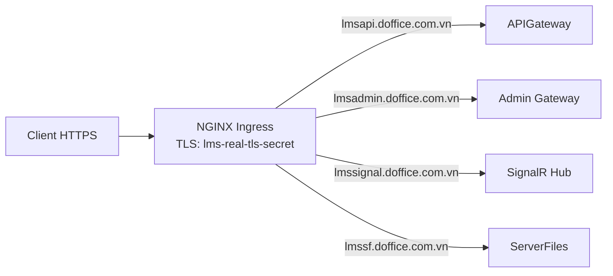

# 05 — Deployment & Operations

> Tài liệu vận hành dựa trên manifest tại `CL4.0-Deployment/`. Mục tiêu: DevOps hoặc người mới onboard nắm được cách hệ thống được triển khai và vận hành ở production.

## 1. Tổng quan triển khai

Hệ thống chạy trên **Kubernetes** với 3 namespace logic:

| Namespace | Vai trò | Workload tiêu biểu |
|---|---|---|
| `microcls-external` | Public-facing (frontend, gateway, signalr, file server) | WebUI, WebUI-Admin, APIGateway, SignalR, ServerFiles |
| `microcls-api-core` | Microservice nghiệp vụ nội bộ | UserService, CourseService, QuestionService, IdentityServer, SharedServices, SystemService, TrainingRoute, Communication, Notification, Log, Mail, Report |
| `cls4-support` | Hạ tầng hỗ trợ | Consul, Eureka, RabbitMQ cluster, Docker Registry |

## 2. Endpoint public

| Endpoint | Service | Port | Ghi chú |
|---|---|---|---|
| `https://lmsapi.doffice.com.vn` | APIGateway (Ocelot) | 8080 | Cổng vào REST chính, public chứa Swagger aggregate |
| `https://lmsadmin.doffice.com.vn` | Admin Internal Gateway | 8089 | Cổng vào cho WebUI-Admin |
| `https://lmssignal.doffice.com.vn` | SignalR Hub | 8015 | WebSocket / SSE, dùng Redis backplane |
| `https://lmssf.doffice.com.vn` | ServerFiles | 8021 | Upload/download file, SCORM serving |

WebUI và WebUI-Admin được build thành static asset và phục vụ qua một service Frontend (Nginx) trong namespace `microcls-external` (xem `cls-service/frontend.yaml`).

## 3. Ingress (NGINX)

Hệ thống có **4 NGINX Ingress controller** với cấu hình:

- TLS secret: `lms-real-tls-secret` (chứng chỉ Let's Encrypt/CA mua ngoài, init bởi `cert/ssl.sh`).
- CORS: bật cho domain `doffice.com.vn` và subdomain.
- Timeout: `proxy-read-timeout: 600s`, `proxy-send-timeout: 600s`.
- Body size limit: 100MB cho API, 500MB cho ServerFiles (upload SCORM lớn).
- Annotation chi tiết tại `CL4.0-Deployment/nginx-ingress.yaml`.



## 4. Support components (namespace `cls4-support`)

### 4.1 Consul (Config Server)

- Service nội bộ: `consul-service.cls4-support.svc.cluster.local:8500`
- Vai trò: KV store chứa `appsettings.{env}.json` cho từng microservice.
- Mỗi service load config lúc khởi động qua `Winton.Extensions.Configuration.Consul`, `ReloadOnChange = true` (config thay đổi không cần restart).
- Manifest: `system/support-components/consul.yaml`.

### 4.2 Eureka (Service Registry)

- Image: `taskbeez/eureka` trên port 8761.
- Vai trò: backup discovery (chủ yếu CLS đã chuyển sang K8s DNS, Eureka tồn tại do code legacy gọi `Steeltoe.Discovery.Eureka`).
- Có thể retire trong migration sang Rust (xem [07-rust-migration-plan.md](07-rust-migration-plan.md)).
- Manifest: `system/support-components/eureka.yaml`.

### 4.3 RabbitMQ cluster (Event Bus)

- 3 replica statefulset với chiến lược `pause_minority` (chống split-brain).
- Broker name: `micro_event_bus`.
- Port: AMQP 5672, Management UI 15672.
- High-watermark memory: 49%.
- Authentication: username/password trong Consul KV key `EventBus:UserName`, `EventBus:Password`.
- Manifest: `system/support-components/rabbitmq.yaml`.

### 4.4 Docker Registry private

- Endpoint: `192.168.1.131:5000` (private LAN registry).
- Image tag format: `192.168.1.131:5000/microcls-<service>:<git-tag>` hoặc `:latest`.
- Image pull: K8s node phải có cấu hình insecure-registry hoặc TLS cert phù hợp.
- Manifest: `system/support-components/docker-registry.yaml`.

### 4.5 Phụ thuộc bên ngoài cluster

Các hạ tầng dưới đây **không** chạy trong K8s mà ở môi trường nội bộ riêng:

- **SQL Server**: lưu data transactional (User/Course/Question/Shared/System/TrainingRoute/Identity).
- **MongoDB**: lưu data NoSQL (Chat, Notification, Log, Test/Exam log).
- **Redis**: SignalR backplane + online user map.
- **SigNoz** (ClickHouse backend): nhận trace/log/metric từ tất cả service qua OpenTelemetry Collector.
- **SMTP server**: MailSender gửi mail thực tế qua đây.

Endpoint của các thành phần này nằm trong Consul KV (xem section Config).

## 5. Cấu trúc deploy của một microservice

Mỗi service có 1 file YAML trong `CL4.0-Deployment/cls-service/<service>.yaml` (production) và `cls-service-test/<service>.yaml` (test environment).

Cấu trúc YAML điển hình:

```yaml
apiVersion: apps/v1
kind: Deployment
metadata:
  name: ${CI_SERVICE_NAME}
  namespace: ${CI_NAMESPACE}
spec:
  replicas: 1-3
  template:
    spec:
      containers:
        - name: app
          image: 192.168.1.131:5000/microcls-${CI_SERVICE_NAME}:${CI_DOCKER_IMAGE_TAG}
          ports:
            - containerPort: ${CI_SERVICE_PORT}
          env:
            - name: ASPNETCORE_ENVIRONMENT
              value: Production
            - name: CONSULHOST
              value: http://consul-service.cls4-support.svc.cluster.local:8500
          resources:
            limits:
              memory: ${CI_MEMORY_LIMIT}   # ví dụ 1Gi
              cpu: ${CI_CPU_LIMIT}         # ví dụ 500m
            requests:
              memory: 256Mi
              cpu: 100m
          livenessProbe:
            httpGet:
              path: /hc
              port: ${CI_SERVICE_PORT}
---
apiVersion: v1
kind: Service
metadata:
  name: ${CI_SERVICE_NAME}-service
  namespace: ${CI_NAMESPACE}
spec:
  type: ClusterIP
  selector:
    app: ${CI_SERVICE_NAME}
  ports:
    - port: ${CI_SERVICE_PORT}
```

Variable `${CI_*}` được thay thế bởi GitLab CI pipeline khi `kubectl apply`.

## 6. Dockerfile pattern

Tất cả service backend dùng cùng pattern (xem `CLS-SharedServices/Dockerfile`):

```dockerfile
FROM mcr.microsoft.com/dotnet/aspnet:3.1 AS runtime
WORKDIR /app
RUN apt-get update && apt-get install -y libc6-dev libgdiplus \
  && rm -rf /var/lib/apt/lists/*
COPY bin/Release/netcoreapp3.1/publish/ .
EXPOSE 80
ENV ASPNETCORE_URLS=http://+:80
ENTRYPOINT ["dotnet", "<Service>.API.dll"]
```

Lưu ý: pattern hiện tại **publish trước rồi COPY**. Tốt hơn nên chuyển sang multi-stage build (build trong image SDK, copy publish output sang image runtime) — đây là một improvement candidate.

`libgdiplus` cần thiết cho `System.Drawing.Common` (CLS dùng để render PDF chứng chỉ, xử lý ảnh).

## 7. CI/CD (GitLab)

Pipeline điển hình mỗi service:

```yaml
stages:
  - build
  - deploy

build:
  stage: build
  only:
    - tags
  script:
    - dotnet publish src/...API/...API.csproj -c Release -o bin/Release/netcoreapp3.1/publish
    - docker build -t 192.168.1.131:5000/microcls-${CI_SERVICE_NAME}:${CI_COMMIT_TAG} .
    - docker push 192.168.1.131:5000/microcls-${CI_SERVICE_NAME}:${CI_COMMIT_TAG}

deploy:
  stage: deploy
  only:
    - tags
  script:
    - envsubst < deploy.yaml | kubectl apply -f -
```

Trigger: push một git tag (ví dụ `v1.4.20`) → pipeline tự build image và rollout K8s.

Variable CI quan trọng (set trong GitLab CI/CD settings):

- `CI_DOCKER_IMAGE_TAG`
- `CI_NAMESPACE`
- `CI_MEMORY_LIMIT`, `CI_CPU_LIMIT`
- `CI_SERVICE_PORT`
- `CI_EXTERNAL_IP` (nếu cần LoadBalancer)
- `CI_SERVICE_NAME`

## 8. Cấu hình runtime (Consul KV)

Mỗi service đọc các key dưới đây từ Consul. Key được tổ chức theo path `<service-name>/<env>/...`.

### Key chung

| Key | Ý nghĩa |
|---|---|
| `ConnectionString` | SQL Server connection chính |
| `IdentityConnectionString` | SQL Server cho identity data |
| `Audience:Authority` | URL IdentityServer (token endpoint) |
| `Audience:ClientId` | Client ID dùng xin token nội bộ |
| `Audience:Secret` | Client secret |
| `Audience:Scope` | Scope token cần |
| `Audience:GrantType` | `client_credentials` hoặc `password` |
| `EventBus:Connection` | RabbitMQ AMQP URL hoặc host |
| `EventBus:UserName` / `Password` | RabbitMQ credentials |
| `EventBus:RetryCount` | Số lần retry publish (Polly) |
| `EventBus:SubscriptionClientName` | Tên queue subscribe |
| `MongoDb:ConnectionString` | MongoDB connection (nếu service dùng Mongo) |
| `MongoDb:Database` | DB name |
| `Redis:Host` | Redis cho SignalR backplane / online map |
| `ElasticConfiguration:Uri` | Elasticsearch endpoint Serilog sink (C# legacy — thay bằng OTEL_EXPORTER trên Rust) |
| `Otel:Endpoint` | OTel Collector gRPC endpoint cho Rust service (mặc định `http://otel-collector:4317`) |
| `MailSettings:Server` / `Port` / `From` / `User` / `Password` | SMTP config |
| `SecretKey:HashPassword` | Secret để hash mật khẩu nội bộ |
| `SecretKey:EmailConfirm` | Secret ký token email confirm |
| `Captcha:SecretKey` | Google reCAPTCHA secret (UserService) |

### Cảnh báo bảo mật

> Repo hiện tại có **secret/cấu hình thật** trong một số file `appsettings.*.json` mẫu. Khuyến nghị mạnh:
> 1. Xoá tất cả secret thật khỏi repo (`git filter-repo` để xoá cả lịch sử nếu nghiêm trọng).
> 2. Chuyển toàn bộ secret sang Consul KV (hoặc Vault / Sealed-secret K8s).
> 3. File `appsettings.*.json` trong repo chỉ giữ placeholder (`__CONSUL__`).
> 4. CI variable `CI_REGISTRY_PASSWORD`, `CI_K8S_TOKEN` phải để trong GitLab Protected Variables, không hard-code.

## 9. Observability

Hệ thống dùng **SigNoz** làm nền tảng observability thống nhất (trace + log + metric). SigNoz chạy self-hosted trên K8s, backend là ClickHouse. Toàn bộ service Rust export dữ liệu qua **OpenTelemetry Collector** bằng giao thức OTLP/gRPC.

```
Rust Service                   C# Service (legacy)
  │ OTLP gRPC :4317               │ Serilog → Console
  ▼                               ▼
OTel Collector (DaemonSet) ──────────────────────────→ SigNoz (ClickHouse)
                                                              │
                                                        SigNoz UI :3301
                                                  (Trace · Log · Metric · Alert)
```

C# service giữ Serilog → Console trong giai đoạn transition; Collector scrape stdout log của pod và forward vào SigNoz.

### 9.1 Deployment SigNoz

```bash
helm repo add signoz https://charts.signoz.io
helm repo update
helm install signoz signoz/signoz \
  --namespace monitoring --create-namespace \
  -f infra/signoz-values.yaml
```

`infra/signoz-values.yaml` tối thiểu:

```yaml
clickhouse:
  resources:
    requests:
      cpu: 500m
      memory: 2Gi
    limits:
      cpu: 2
      memory: 4Gi

otelCollector:
  enabled: true
  config:
    receivers:
      otlp:
        protocols:
          grpc: { endpoint: "0.0.0.0:4317" }
          http: { endpoint: "0.0.0.0:4318" }
      filelog:                           # scrape stdout log của mọi pod
        include: ["/var/log/pods/*/*/*.log"]
        include_file_path: true
        operators:
          - type: json_parser
    processors:
      batch: {}
      resourcedetection:
        detectors: [env, k8snode]
    exporters:
      clickhouse:
        endpoint: tcp://clickhouse:9000
        database: signoz_traces
    service:
      pipelines:
        traces:   { receivers: [otlp],     processors: [batch], exporters: [clickhouse] }
        logs:     { receivers: [filelog],  processors: [batch], exporters: [clickhouse] }
        metrics:  { receivers: [otlp],     processors: [batch], exporters: [clickhouse] }

frontend:
  service:
    type: ClusterIP    # expose qua Ingress riêng, không dùng NodePort

ingress:
  enabled: true
  hosts:
    - host: signoz.internal.doffice.com.vn
      paths: ["/"]
  tls:
    - secretName: signoz-tls-secret
      hosts: [signoz.internal.doffice.com.vn]
```

> SigNoz UI chỉ expose trên internal domain, không public internet.

### 9.2 OpenTelemetry Collector — K8s manifest

Collector chạy như DaemonSet để scrape log từng node:

```yaml
# infra/otel-collector-daemonset.yaml
apiVersion: apps/v1
kind: DaemonSet
metadata:
  name: otel-collector
  namespace: monitoring
spec:
  selector:
    matchLabels:
      app: otel-collector
  template:
    metadata:
      labels:
        app: otel-collector
    spec:
      volumes:
        - name: varlogpods
          hostPath: { path: /var/log/pods }
        - name: otel-config
          configMap: { name: otel-collector-config }
      containers:
        - name: collector
          image: otel/opentelemetry-collector-contrib:0.100.0
          ports:
            - containerPort: 4317   # gRPC
            - containerPort: 4318   # HTTP
          volumeMounts:
            - name: varlogpods
              mountPath: /var/log/pods
              readOnly: true
            - name: otel-config
              mountPath: /etc/otel
          args: ["--config=/etc/otel/config.yaml"]
---
apiVersion: v1
kind: Service
metadata:
  name: otel-collector
  namespace: monitoring
spec:
  clusterIP: None   # headless — dùng tên DNS từ mọi namespace
  selector:
    app: otel-collector
  ports:
    - name: grpc
      port: 4317
    - name: http
      port: 4318
```

Service Rust trỏ đến `http://otel-collector.monitoring.svc.cluster.local:4317`.

### 9.3 Biến môi trường (Rust service)

Thêm vào K8s Deployment (hoặc Consul KV key `Otel:*`):

```yaml
env:
  - name: OTEL_EXPORTER_OTLP_ENDPOINT
    value: "http://otel-collector.monitoring.svc.cluster.local:4317"
  - name: OTEL_SERVICE_NAME
    value: "mailsender"                # tên service, thay cho từng service
  - name: OTEL_RESOURCE_ATTRIBUTES
    value: "deployment.environment=production,team=backend"
  - name: RUST_LOG
    value: "info"
```

### 9.4 Tracing — distributed trace

Mỗi Rust service dùng `tracing-opentelemetry` để tự động tạo span cho:
- HTTP request (qua `axum-tracing-opentelemetry` middleware)
- DB query (qua `sqlx-tracing` hoặc `tracing::instrument` thủ công)
- RabbitMQ publish/consume (inject `traceparent` header vào AMQP message)

`trace_id` được propagate theo W3C TraceContext. SigNoz tự ghép span thành trace tree qua `trace_id`, không cần cấu hình thêm.

### 9.5 Logging — structured log

- Rust service ghi JSON log ra stdout (qua `tracing-subscriber` với `fmt::layer().json()`).
- OTel Collector scrape stdout của pod, parse JSON, gắn thêm `k8s.pod.name`, `k8s.namespace.name`.
- Mỗi log line tự động có `trace_id` nếu log được emit bên trong một span (tracing-opentelemetry bridge).
- SigNoz cho phép click trace_id trong Logs view để nhảy thẳng sang Trace detail.

C# service (legacy): Serilog ghi JSON console, cùng pipeline Collector scrape.

### 9.6 Metrics

Rust service export metric qua OTLP bằng `opentelemetry_sdk` metrics API:

```rust
// Khởi tạo meter trong cls-observability
let meter = global::meter("cls");
let request_counter = meter
    .u64_counter("http.server.request.count")
    .with_description("Total HTTP requests")
    .init();
```

Dashboard mặc định cần tạo trong SigNoz:
- Throughput req/s per service
- P50/P95/P99 latency per endpoint
- Error rate (HTTP 5xx)
- RabbitMQ consumer lag (metric từ RabbitMQ Prometheus plugin → Collector)
- Memory RSS per pod

### 9.7 Healthcheck

- Endpoint `/hc` mở bởi `AspNetCore.HealthChecks` (C#) / Axum health route (Rust).
- K8s `livenessProbe` và `readinessProbe` cùng trỏ về `/hc`.
- Một số service check thêm dependency: DB ping, RabbitMQ ping.

### 9.8 Alerts (SigNoz Alert Manager)

| Alert | Query | Threshold | Severity |
|---|---|---|---|
| High error rate | `rate(http.server.request.count{http.status_code=~"5.."}[5m])` | > 1% total | Critical |
| Slow P99 | `histogram_quantile(0.99, http.server.duration)` | > 2s | Warning |
| Service down | Không có span trong 3 phút | — | Critical |
| RabbitMQ lag | `rabbitmq_queue_messages_unacknowledged` | > 1000 | Warning |
| Pod memory | `container_memory_rss` | > 80% limit | Warning |

Alert gửi qua webhook (Slack / Teams / email) — cấu hình trong SigNoz Settings → Alert Channels.

## 10. Backup & disaster recovery

| Đối tượng | Trạng thái hiện tại | Khuyến nghị |
|---|---|---|
| SQL Server | Backup thủ công/scheduled chưa rõ trong repo | Setup full backup hàng đêm + tx-log backup 15 phút, retention 30 ngày |
| MongoDB | Tương tự | `mongodump` định kỳ + replica set 3-node |
| Consul KV | Manifest có persistent volume | `consul snapshot save` định kỳ |
| ServerFiles disk | Persistent volume K8s | Snapshot volume + offsite sync |
| RabbitMQ | Cluster 3-replica → tự HA | Định kỳ export definitions (`rabbitmqctl export_definitions`) |

## 11. Runbook ngắn

### 11.1 Rollback một service

```bash
# Tìm tag image trước đó
docker pull 192.168.1.131:5000/microcls-courseapi:v1.4.19

# Sửa deployment manifest về tag cũ + apply
kubectl set image deployment/courseapi-deployment app=192.168.1.131:5000/microcls-courseapi:v1.4.19 -n microcls-api-core

# Kiểm tra
kubectl rollout status deployment/courseapi-deployment -n microcls-api-core
```

### 11.2 Restart Consul (cẩn thận — sẽ làm service tạm mất config)

```bash
kubectl rollout restart statefulset/consul -n cls4-support
# Đợi consul ready
kubectl rollout status statefulset/consul -n cls4-support
# Restart toàn bộ service để reload config
kubectl rollout restart deployment -n microcls-api-core
```

### 11.3 RabbitMQ split-brain

- Cluster có 3 replica với `pause_minority`. Nếu split: node minority sẽ tự pause.
- Recovery: `rabbitmqctl start_app` trên node minority sau khi network heal.
- Nếu mất queue: import lại từ definitions backup.

### 11.4 Re-issue TLS

```bash
# Update secret
kubectl create secret tls lms-real-tls-secret \
  --cert=fullchain.pem --key=privkey.pem \
  --dry-run=client -o yaml | kubectl apply -f - -n microcls-external

# Ingress controller tự reload, không cần restart
```

### 11.5 SigNoz — ClickHouse disk đầy

```bash
# Kiểm tra dung lượng
kubectl exec -n monitoring clickhouse-0 -- df -h /var/lib/clickhouse

# Xoá dữ liệu trace/log cũ hơn 30 ngày
kubectl exec -n monitoring clickhouse-0 -- clickhouse-client --query \
  "ALTER TABLE signoz_traces.signoz_index_v2 DELETE WHERE timestamp < now() - INTERVAL 30 DAY"
kubectl exec -n monitoring clickhouse-0 -- clickhouse-client --query \
  "ALTER TABLE signoz_logs.logs DELETE WHERE timestamp < now() - INTERVAL 30 DAY"

# Tối ưu bảng sau xoá
kubectl exec -n monitoring clickhouse-0 -- clickhouse-client --query \
  "OPTIMIZE TABLE signoz_traces.signoz_index_v2 FINAL"
```

Cấu hình retention tự động trong `signoz-values.yaml`:

```yaml
clickhouse:
  coldStorage:
    enabled: false
  # TTL tự động
  ttl:
    traces: 30   # ngày
    logs:   15
    metrics: 90
```

### 11.6 OTel Collector không nhận trace

```bash
# Kiểm tra log Collector
kubectl logs -n monitoring daemonset/otel-collector --tail=50

# Test gửi trace thủ công
kubectl run otel-test --rm -it --image=curlimages/curl -- \
  curl -X POST http://otel-collector.monitoring.svc.cluster.local:4318/v1/traces \
  -H "Content-Type: application/json" -d '{"resourceSpans":[]}'

# Xem số span Collector nhận được (metric của chính Collector)
kubectl port-forward -n monitoring svc/otel-collector 8888:8888
curl http://localhost:8888/metrics | grep otelcol_receiver_accepted_spans
```

### 11.7 SigNoz UI không load được trace

1. Kiểm tra ClickHouse còn running: `kubectl get pod -n monitoring -l app=clickhouse`.
2. Kiểm tra SigNoz query-service log: `kubectl logs -n monitoring deploy/signoz-query-service`.
3. Đảm bảo service Rust đang gửi đúng `OTEL_EXPORTER_OTLP_ENDPOINT` — port 4317 (gRPC), không phải 4318 (HTTP).

## 12. Improvement backlog (DevOps)

Các điểm nên cải thiện trong môi trường hiện tại:

1. Multi-stage Dockerfile (build và publish trong image SDK, không yêu cầu publish trước khi build).
2. ~~Distributed tracing với OpenTelemetry~~ — **Đã giải quyết**: SigNoz + OTel Collector (xem section 9).
3. ~~Prometheus + Grafana cho metrics~~ — **Đã giải quyết**: SigNoz metrics dashboard (xem section 9.6).
4. Secret management (Vault / Sealed Secret) thay vì Consul KV plaintext.
5. GitOps (ArgoCD / Flux) thay vì `kubectl apply` thủ công trong CI.
6. Image scanning (Trivy / Snyk) trong pipeline.
7. Blue/green deployment cho service nghiệp vụ quan trọng (Course, Question, User).
8. Khi migrate Rust: chuẩn hoá lại resource limit (Rust dùng RAM ít hơn nhiều — set limit thấp hơn .NET).
9. SigNoz retention policy và cold storage (S3/MinIO) khi ClickHouse disk vượt 50 GB.
