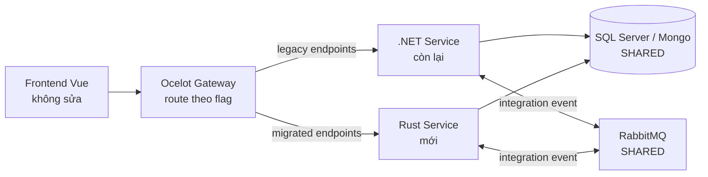

# 07 — Kế hoạch migrate backend sang Rust

> **Phần 2 của bộ tài liệu**. Mục tiêu: rewrite toàn bộ backend .NET Core 3.1 sang Rust theo Strangler-fig, **giữ frontend Vue 2 nguyên trạng** và **giữ contract API/JWT/event payload tương thích ngược** trong toàn bộ quá trình.
>
> Audience: tech lead, kiến trúc sư, stakeholder cần đánh giá khả thi và rủi ro.

## A. Tại sao migrate

### A.1 Lý do bắt buộc

| Lý do | Chi tiết |
|---|---|
| **.NET Core 3.1 EOL** | Microsoft kết thúc hỗ trợ tháng 12/2022. Không còn security patch. Phải hoặc nâng .NET 6+ hoặc rewrite. |
| **Vulnerability risk** | Service public-facing chạy runtime EOL → audit/compliance fail. |
| **License & dependency** | IdentityServer4 đã chuyển commercial từ v5. SQL Server license đắt khi scale. |

### A.2 Lý do chọn Rust thay vì nâng .NET

| Tiêu chí | Rust | .NET 8 |
|---|---|---|
| Memory footprint | Thấp (~30-50MB/service) | Trung bình (~150-300MB/service) |
| Throughput latency | Rất cao, p99 ổn định | Cao, nhưng GC pause |
| Safety | Memory + thread safety compile-time | Memory safe (GC), không có data-race check compile-time |
| Effort migrate | Lớn (rewrite + học ngôn ngữ) | Nhỏ hơn (chủ yếu cập nhật API) |
| Ecosystem .NET có | Đầy đủ enterprise | — |
| Ecosystem Rust có | Mature cho web/db/messaging | — |
| Cost K8s sau migrate | Giảm 50-70% RAM, 30-50% CPU | Cải thiện nhẹ so với 3.1 |

**Kết luận**: Rust là lựa chọn dài hạn nếu chấp nhận chi phí ban đầu (training + rewrite). Nếu cần kết quả nhanh trong 6 tháng, nâng .NET 8 hợp lý hơn. **Tài liệu này giả định đã chọn Rust.**

### A.3 Trade-off cần chấp nhận

- Team cần học Rust: senior ramp-up ~3 tháng, junior ~6 tháng.
- Velocity Pha 0-1 chậm hơn .NET (~50% throughput dev).
- Một số thư viện .NET không có drop-in Rust (MediatR, EF Core migrations) — phải tự build hoặc đổi pattern.
- Driver SQL Server (Tiberius) chưa mature bằng Postgres driver Rust — có thể phải đổi DB.

## B. Chiến lược Strangler-fig

### B.1 Nguyên tắc cốt lõi

1. **Không big-bang rewrite**. Service Rust dựng song song service .NET; cutover từng endpoint qua Gateway.
2. **Giữ nguyên contract**:
   - JSON DTO format giữ y nguyên (kể cả PascalCase/casing).
   - JWT token format y hệt (cùng claims, audience, signing algorithm).
   - RabbitMQ event payload + routing key y nguyên.
   - Database schema giữ nguyên — Rust và .NET cùng dùng 1 DB.
3. **Frontend không sửa** trong toàn bộ migration. Nếu phải đổi API, dùng adapter layer.
4. **Parity test** bắt buộc trước cutover: gửi cùng input cho .NET và Rust, so sánh output.
5. **Feature flag / route toggle** ở Gateway: chuyển 1%, 10%, 50%, 100% traffic sang Rust theo tiến độ ổn định.

### B.2 Mô hình triển khai trong giai đoạn migrate



### B.3 Cutover pattern cho 1 service

```mermaid
sequenceDiagram
    participant Net as .NET Service
    participant Rust as Rust Service
    participant GW as Gateway
    participant FE as Frontend

    Note over Rust: 1. Dev Rust, dùng chung DB
    Note over Rust: 2. Parity test (shadow traffic)<br/>FE -> .NET; song song call Rust và so sánh
    Note over GW: 3. Canary: route 5% -> Rust
    Note over GW: 4. Tăng dần: 25% -> 50% -> 100%
    Note over Net: 5. Sau 2 tuần stable: retire .NET image
```

## C. Tech-stack mapping .NET → Rust

| Thành phần .NET | Tương đương Rust | Đánh giá |
|---|---|---|
| ASP.NET Core Web API | **Axum** (Tokio) hoặc Actix-web | Axum: idiomatic, hệ sinh thái Tokio. **Khuyến nghị Axum.** |
| Kestrel server | **Hyper** (Axum builds on it) | Tự động qua Axum. |
| EF Core + SQL Server | **SQLx** + `tiberius` driver, hoặc **SeaORM** | SQLx có compile-time check rất mạnh. Tiberius chưa mature như sqlx-postgres → đánh giá kỹ Pha 1. |
| Dapper | **SQLx raw query + FromRow derive** | Mapping 1-1. |
| MongoDB.Driver | **mongodb (official)** | OK, async + BSON. |
| MediatR | Custom dispatcher / **tower::Service** | Không có drop-in. Pattern Command/Query vẫn áp dụng — implement trait `CommandHandler<C, R>` + dispatcher. |
| MediatR Behavior (Logging/Validation/Transaction) | **tower middleware layers** | Compose layers theo thứ tự. |
| Autofac DI | **Application state pattern (Axum)** + manual wiring hoặc **shaku** | Rust khuyến khích explicit; ban đầu hơi verbose nhưng tracable. |
| FluentValidation | **validator** crate | Có macro derive Validate. |
| IdentityServer4 | **Keycloak** (out-of-process) hoặc **ory/hydra** | Không rewrite, dùng OSS có sẵn. JWT signing key giữ tương thích. |
| Ocelot Gateway | **Pingora** (Cloudflare) / Envoy / giữ Ocelot tới pha cuối | Pingora rất performant nhưng dev experience kém hơn Envoy. |
| SignalR Hub | **socketioxide** / **axum-tungstenite** custom SignalR protocol | Điểm rủi ro lớn nhất — xem Pha 3. |
| RabbitMQ + custom EventBus | **lapin** + custom EventBus trait | Direct mapping. |
| Hangfire | **Apalis** + Redis backend / **tokio-cron-scheduler** | Apalis có queue, retry, scheduling. Không có dashboard tốt → tự build hoặc dùng Grafana. |
| Serilog | **tracing** + tracing-subscriber | Structured log. |
| Elasticsearch sink | tracing exporter custom hoặc **opentelemetry-otlp** → Elastic APM | OpenTelemetry là chuẩn cho tương lai. |
| Swashbuckle Swagger | **utoipa** | Macro derive OpenAPI. |
| Polly retry | **backoff** crate hoặc tower retry layer | Tương đương. |
| Consul config | **consul-rs** + **config** crate (figment alternative) | OK. Hot-reload phải tự handle. |
| Eureka | **Bỏ Eureka**, dùng K8s DNS service discovery | Đơn giản hoá. |
| AutoMapper | Manual `From`/`TryFrom` impl hoặc **derive_more** | Rust trait From là idiomatic. |
| EPPlus (Excel) | **rust_xlsxwriter** + **calamine** (đọc) | OK. |
| iText/PDF | **printpdf** / **pdfium-render** | Có nhưng less polished — đánh giá khi đến pha có chứng chỉ PDF. |
| System.Drawing.Common | **image** crate + **resvg** | OK. |
| Background job với DB persistence | **Apalis-sql** với SQLx | OK. |

## D. Lộ trình theo pha

**Tổng thời gian ước tính**: 18-24 tháng với team 4-6 dev.

### Pha 0 — Chuẩn bị (1 tháng)

Mục tiêu: dựng foundation.

Việc cần làm:
- Setup repo Rust workspace (mono-repo `cls-rust/`) với crate structure:
  ```
  cls-rust/
    crates/
      cls-core/             <- EventBus, JWT middleware, error types, observability
      cls-db/               <- SQLx pool + Tiberius wrapper
      cls-eventbus/         <- IEventBus trait + RabbitMQ impl (lapin)
      cls-auth/             <- JWT validation, claims parsing
      cls-observability/    <- tracing config + Elastic exporter
    services/
      mailsender/           <- Pha 1
      notificationservice/  <- Pha 2
      ...
  ```
- CI/CD: GitLab pipeline Rust (cargo build, clippy, fmt, test, Docker multi-stage build).
- Coding standard:
  - Error handling: `thiserror` cho lib, `anyhow` cho binary.
  - Async runtime: Tokio only.
  - Logging: `tracing` macros.
  - Naming: snake_case, mapping sang JSON PascalCase qua `serde rename`.
- Training:
  - 2 senior dev Rust offline 2 tuần (book: Rust for Rustaceans; course: Zero to Production in Rust).
  - Workshop nội bộ.

Deliverable: workspace build được, có sample "hello world" service deploy lên K8s.

### Pha 1 — PoC service đơn giản (1-2 tháng)

Service: **MailSender**.

Lý do chọn: ít business rule, chỉ consume RabbitMQ + render template + gửi SMTP. Phù hợp validate pattern Rust.

Việc làm:
- Implement EventBus consume trên lapin.
- Replace Hangfire bằng Apalis (job queue + retry).
- Render template với `tera` (Jinja-like syntax).
- SMTP với `lettre` crate.
- Healthcheck endpoint cho K8s.

Acceptance:
- 100% event mail từ .NET hệ thống được consume bởi Rust service (chạy parallel).
- Benchmark vs .NET MailSender: throughput, RAM, CPU.
- **Gate**: nếu benchmark Rust không ≥ 2x .NET hoặc team không follow kịp → STOP migration, đánh giá lại.

### Pha 2 — Service stateless/IO-bound (2-3 tháng)

Service:
1. **NotificationService** (FCM push) — chỉ consume event, gọi FCM HTTP API, ghi Mongo.
2. **LogService** (Mongo writer) — consume event, ghi `SystemActivity`/`ViolateUser` vào Mongo.

Việc làm:
- Validate pattern Rust + MongoDB + IntegrationEvent.
- Build crate `cls-mongo` wrapper.
- Build observability đầy đủ (correlation ID, distributed tracing).

Acceptance:
- Cutover hoàn toàn 2 service này sang Rust.
- Retire image .NET tương ứng.

### Pha 3 — Service realtime + file (3 tháng) ⚠️ HIGH RISK

Service:
1. **ServerFiles** — upload/download, SCORM serving. Rust hiệu quả cao cho file I/O.
2. **SignalR** — **điểm rủi ro lớn nhất** vì SignalR protocol riêng của Microsoft.

#### SignalR rewrite strategy

SignalR protocol có 2 transport: WebSocket (chính) + Long Polling (fallback) + Server-Sent Events. Payload là JSON (`{type, target, arguments, ...}`) với handshake riêng.

**Phương án A — Implement SignalR protocol (khuyến nghị)**:
- Frontend `@microsoft/signalr` client KHÔNG sửa.
- Rust service implement đúng spec SignalR (handshake, ping/pong, invocation, streaming).
- Có thư viện community `signalrs` (Rust) nhưng chưa hoàn thiện — có thể phải fork/contribute.
- Redis backplane: dùng `redis` crate pub/sub.

**Phương án B — Đổi sang WebSocket native + socketioxide**:
- Frontend phải sửa: thay `@microsoft/signalr` bằng `socket.io-client` hoặc native WebSocket.
- Vi phạm nguyên tắc "frontend không sửa" → chỉ chọn nếu phương án A thất bại.

**Phương án C — Giữ SignalR .NET vĩnh viễn**:
- Nếu Pha 3 phương án A thất bại sau 2 tháng → giữ SignalR .NET, chỉ migrate phần còn lại.

Acceptance:
- ServerFiles cutover 100%, đo throughput upload/download.
- SignalR cutover canary, monitor error rate, reconnect rate.
- Frontend không sửa code.

### Pha 4 — Service "outer ring" (3-4 tháng)

Service ít coupling sâu với business rule cốt lõi:
1. **SharedServices** — Article, Library, Certification template, Gift, Theme.
2. **SystemService** — EmailTemplate, NotificationConfig, Widget, CustomReport.
3. **CommunicationService** — Chat store, test/exam log (Mongo).
4. **ReportService** — báo cáo tổng hợp.

Việc làm:
- Áp dụng pattern đã chuẩn hoá từ Pha 1-3.
- Mỗi service: parity test suite trước cutover.

### Pha 5 — Service nghiệp vụ cốt lõi (4-6 tháng) ⚠️ HIGHEST RISK

Service:
1. **TrainingRouteService**
2. **QuestionService** (logic chấm điểm, anti-cheat, import Excel)
3. **CourseService** (enrollment lifecycle, content, training plan)
4. **UserService** (auth bridging, portal, org, role, HR, address)

Đây là phần "ruột" hệ thống — business rule phức tạp nhất.

Yêu cầu **bắt buộc**:
- 100% endpoint phải có parity test trước cutover.
- Mỗi service phải có integration test suite chạy cùng schema DB production replica.
- Roll-back plan: route Gateway về .NET trong vòng 5 phút nếu phát hiện regression.
- Dual-write nếu cần ghi sang cả 2 service (Rust + .NET) trong giai đoạn canary.

### Pha 6 — Replace IdentityServer (2 tháng)

Thay IdentityServer4 bằng **Keycloak**.

Việc làm:
- Cấu hình Keycloak realm = portal (multi-tenant).
- Migrate Client/ApiResource/ApiScope từ SQL Server IdentityServer sang Keycloak DB (Postgres).
- Migrate user credentials (hash → Keycloak hash format).
- JWT signing key: nếu giữ cùng key → service Rust không cần đổi validation. Nếu đổi key (khuyến nghị xoay key) → schedule downtime hoặc rolling JWKS update.
- Social login: cấu hình Identity Provider trong Keycloak.

Alternative: viết Rust authorization server (rất tốn công, không khuyến nghị).

### Pha 7 — Replace Gateway (1-2 tháng)

Thay Ocelot bằng Pingora hoặc giữ Envoy.

Việc làm:
- Mapping route Ocelot config → Pingora/Envoy config.
- JWT middleware (validate Keycloak JWT).
- Rate limiting + circuit breaker.
- Swagger aggregation: build tool aggregate từng service utoipa spec.

### Pha 8 — Cleanup (1 tháng)

- Retire image .NET, retire Consul (chuyển sang K8s ConfigMap + Vault).
- Retire Eureka.
- Tối ưu K8s resource limit (Rust dùng ít RAM hơn).
- Documentation refresh.

## E. Chiến lược database

### E.1 Pha 1-5 — dùng chung DB

- Rust service kết nối **trực tiếp** SQL Server / Mongo hiện hữu.
- EF Core migration vẫn là canonical source — Rust không sinh schema, chỉ đọc schema có sẵn.
- Race condition: tránh ghi cùng row từ cả Rust và .NET trong giai đoạn dual-run. Solution: feature flag (chỉ 1 service ghi cùng lúc, service còn lại read-only).

### E.2 Pha 6+ — đánh giá đổi sang PostgreSQL

Lý do:
- Driver Rust cho Postgres (`tokio-postgres`, sqlx-postgres) mature hơn Tiberius cho SQL Server.
- Postgres license rẻ hơn (Open source).
- Ecosystem extension Postgres mạnh (pg_partman, pgvector...).

Rủi ro:
- Migration data SQL Server → Postgres: dùng `pgloader` hoặc tool build riêng.
- Một số SQL syntax khác (NVARCHAR vs TEXT, datetime, IDENTITY vs SERIAL).
- Stored procedure / function trong SQL Server (nếu có) phải rewrite.

**Khuyến nghị**: chỉ làm pha 6+ nếu Tiberius gây vấn đề ở Pha 1. Nếu Tiberius OK, giữ SQL Server cho ổn định.

## F. Rủi ro & mitigation

| # | Rủi ro | Mức độ | Pha xảy ra | Mitigation |
|---|---|---|---|---|
| 1 | Team thiếu kinh nghiệm Rust | Cao | Pha 0-2 | Pha 0 training 2 tuần; thuê 1-2 senior Rust dev contract; pair programming; code review nghiêm ngặt. |
| 2 | SignalR rewrite thất bại | Cao | Pha 3 | Phương án A trước (giữ frontend); fallback phương án C (giữ SignalR .NET); set quota 2 tháng, sau đó re-plan. |
| 3 | Business rule miss khi rewrite | Rất cao | Pha 4-5 | Parity test bắt buộc; canary 1%-10%-50%-100% gradual; feature flag để rollback nhanh; dual-run minimum 2 tuần per service. |
| 4 | EF Core migration history phức tạp | Trung | Pha 5 | Giữ EF Core làm canonical schema; SQLx chỉ đọc/ghi theo schema EF; không sinh schema từ Rust. |
| 5 | Tiberius (SQL Server Rust) chưa mature | Trung | Pha 1+ | Đánh giá kỹ Pha 1; fallback SeaORM; hoặc migrate Postgres ở Pha 6. |
| 6 | Downtime/data corruption khi cutover | Rất cao | Pha 4-5 | Dual-write idempotent; rollback plan ≤5 phút; monitoring error budget 99.95%; cutover ngoài giờ làm việc. |
| 7 | Hangfire dashboard mất | Thấp | Pha 1 | Apalis chưa có UI; build dashboard tối thiểu hoặc tích hợp Grafana metrics. |
| 8 | Cost cao hơn dự kiến | Trung | Toàn bộ | Decision gate cuối Pha 1 (xem section H); có thể stop nếu ROI không đạt. |
| 9 | Vendor lock-in Keycloak | Thấp | Pha 6 | Keycloak open source, có exit plan (ory/hydra alternative). |
| 10 | Tài liệu nội bộ thiếu | Trung | Toàn bộ | Bắt buộc viết doc Rust crate; ADR cho mọi quyết định. |
| 11 | Performance regression | Cao | Pha 5+ | Benchmark mỗi service trước/sau; load test định kỳ; SLO p99 < .NET baseline. |
| 12 | Library Rust deprecated giữa chừng | Thấp | Toàn bộ | Pin version trong Cargo.toml; audit `cargo deny` định kỳ; ưu tiên crate có maintainer rõ ràng. |

## G. Effort & cost ước lượng

### G.1 Effort dev

| Pha | Service count | Effort (mandays) |
|---|---|---|
| 0 Chuẩn bị | - | 60 |
| 1 PoC MailSender | 1 | 80 |
| 2 Notification + Log | 2 | 150 |
| 3 ServerFiles + SignalR | 2 | 250 |
| 4 Outer ring (4 service) | 4 | 400 |
| 5 Core (4 service) | 4 | 700 |
| 6 IdentityServer → Keycloak | 1 | 120 |
| 7 Gateway | 1 | 100 |
| 8 Cleanup | - | 60 |
| **Tổng** | **18** | **~1920 mandays** |

Team 4 dev → ~480 mandays/dev → ~24 tháng (với 20 working days/month).
Team 6 dev → ~320 mandays/dev → ~16 tháng.

### G.2 Cost saving sau migrate

Dựa trên benchmark thực tế các project migrate .NET → Rust:
- RAM: giảm 50-70%.
- CPU: giảm 30-50%.
- K8s pod count có thể giảm.

Ước tính: nếu cost K8s + license hiện tại 10K USD/tháng, sau migrate khoảng 4-5K USD/tháng (tiết kiệm ~5K USD/tháng).

Break-even: 12-18 tháng sau khi pha 5 hoàn tất (tổng thời gian payback ~3-3.5 năm tính cả pha rewrite).

## H. Decision gates (quan trọng)

| Gate | Khi nào | Tiêu chí GO | Hành động NO-GO |
|---|---|---|---|
| **G1: Sau Pha 1** | Tháng 2-3 | Benchmark Rust MailSender ≥ 2x .NET (RAM hoặc throughput); team theo kịp tốc độ | Stop migration, đánh giá nâng .NET 8 |
| **G2: Sau Pha 3** | Tháng 6-7 | SignalR phương án A hoạt động hoặc phương án C chấp nhận được; ServerFiles cutover 100% | Giữ SignalR + ServerFiles .NET, chỉ migrate phần còn lại |
| **G3: Sau Pha 5** | Tháng 14-18 | Core service 4 cái cutover ổn định ≥ 1 tháng; error rate ≤ baseline | Đánh giá có làm pha 6-7 hay dừng (giữ IdentityServer + Ocelot) |

## I. Ánh xạ từng service: ưu tiên & complexity

| Service | Complexity rewrite | Risk | Priority pha |
|---|---|---|---|
| MailSender | Thấp | Thấp | Pha 1 |
| NotificationService | Thấp | Thấp | Pha 2 |
| LogService | Thấp | Thấp | Pha 2 |
| ServerFiles | Trung | Trung | Pha 3 |
| SignalR | Cao | Cao | Pha 3 |
| SharedServices | Trung | Thấp | Pha 4 |
| SystemService | Trung | Thấp | Pha 4 |
| CommunicationService | Thấp | Thấp | Pha 4 |
| ReportService | Trung | Trung (SQL phức tạp) | Pha 4 |
| TrainingRouteService | Trung | Trung | Pha 5 |
| QuestionService | Cao | Cao (logic chấm, import Excel) | Pha 5 |
| CourseService | Cao | Cao (enrollment lifecycle) | Pha 5 |
| UserService | Cao | Cao (auth bridging, multi-tenant) | Pha 5 |
| IdentityServer | N/A | Trung | Pha 6 (replace Keycloak) |
| APIGateway | Trung | Trung | Pha 7 (replace Pingora/Envoy) |
| CLS4.0-Core | (shared library, không service) | - | Tương đương `cls-rust/crates/cls-core` từ Pha 0 |

## J. Tài liệu tham khảo nội bộ

- [01-system-overview.md](01-system-overview.md) — bản đồ kiến trúc hiện tại.
- [02-backend-feature-catalog.md](02-backend-feature-catalog.md) — chi tiết tính năng mỗi service cần được giữ nguyên khi rewrite.
- [04-database-schema.md](04-database-schema.md) — schema phải khớp khi Rust kết nối DB.
- [05-deployment-operations.md](05-deployment-operations.md) — hạ tầng cần giữ tương thích.

## K. Khuyến nghị thực thi

1. **Bắt đầu nhỏ**. Đừng ôm pha 5 ngay. Để Pha 1 chứng minh value trước khi cam kết budget toàn bộ.
2. **Đầu tư parity test**. Đây là phần quan trọng nhất — không có parity test → rewrite không thể trust.
3. **Giữ contract**. Bất kỳ thay đổi API/event payload nào → đặt câu hỏi: có cần thiết không, có thể defer không.
4. **Observability sớm**. Distributed tracing + metrics phải có từ Pha 0 để so sánh hiệu năng objective.
5. **Document ADR** (Architecture Decision Record) cho mỗi quyết định lớn (chọn Axum, chọn Keycloak, đổi Postgres...).
6. **Rollback first**. Trước khi cutover service nào, luôn xác nhận rollback ≤5 phút và đã test rollback.
7. **Communicate**. Stakeholder phải hiểu đây là 18-24 tháng, có decision gate, có thể stop. Tránh "đã đầu tư rồi không thể dừng" syndrome.
