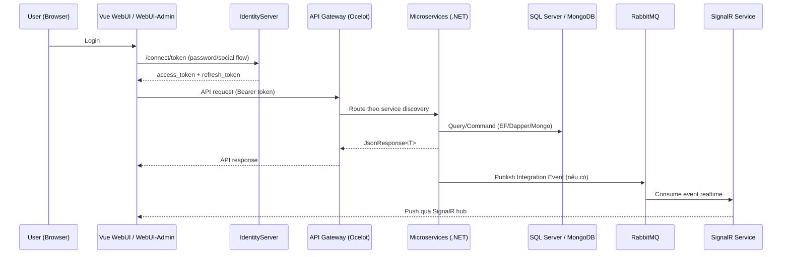

# Tài liệu Technical Design

## 1) Tổng quan hệ thống (System Design)

### 1.1 Kiến trúc tổng thể

Hệ thống đang triển khai theo **Microservices** với phong cách **DDD + CQRS + Clean layering** ở từng service:

- **API layer**: `*.API` (Controller, Command/Query Model, Handler, DI module).
- **Domain layer**: `*.Domain` (Entity/Aggregate, Repository interface, Query contract, Enum, business rule).
- **Infrastructure layer**: `*.Infrastructure` (EF Core DbContext, Repository implementation, Dapper/Mongo queries, migrations).
- **Core shared**: `CLS4.0-Core` cung cấp nền tảng chung (middleware, auth JWT, EventBus RabbitMQ, discovery, logging, base repository, base query, response contract).

Thành phần runtime chính:

- **Identity**: `CL4.0-IdentityServer` (IdentityServer4) cấp token OAuth2/OIDC.
- **Gateway**: `CLS4.0-APIGateway` (Ocelot + Eureka + cấu hình từ Consul).
- **Business services**: User, Course, Question, Shared, System, TrainingRoute, Communication, SignalR, Notification, Log, ServerFiles, MailSender, ...
- **Frontend**: `CLS4.0-WebUI` (cổng người dùng) và `CLS4.0-WebUI-Admin` (cổng quản trị), đều dùng Vue 2 + Vuex + Axios.

### 1.2 Luồng dữ liệu Frontend ↔ Backend



### 1.3 Nhận xét kiến trúc

- Mức độ tách miền nghiệp vụ cao (service theo bounded context).
- Chấp nhận **polyglot persistence**: SQL Server (transactional nghiệp vụ) + MongoDB (log/chat/notification timeline).
- Cấu hình runtime phụ thuộc mạnh vào **Consul** (`CONSULHOST`) và service discovery (`Steeltoe/Eureka`).

---

## 2) Thiết kế chi tiết đối tượng & Service

## 2.1 Pattern kỹ thuật đang dùng trong backend

- **Controller mỏng**: đa số action gọi `ExecuteCommand(...)` từ `CustomController` (MediatR).
- **Command/Query tách biệt**:
  - Command Handler cho mutate.
  - Query classes (`QueryBase`, `MongoQueryBase`) cho read tối ưu.
- **Repository pattern**:
  - Interface trong Domain (`ICourseRepository`, `IUserRepository`...).
  - Implementation trong Infrastructure (`CourseRepository`, `UserRepository`...).
- **Cross-cutting pipeline** (MediatR Behavior): Logging, Validation, Transaction.

## 2.2 Class/Interface quan trọng theo service

| Service | Entity/Aggregate tiêu biểu | Repository Interface tiêu biểu | Query/Service xử lý logic chính |
|---|---|---|---|
| **UserService** | `ApplicationUser`, `Group`, `OrganizationalStructure`, `Portal`, `Management`, `JwtLog` | `IUserRepository`, `IGroupRepository`, `IOrganizationalStructureRepository`, `IPortalRepository` | `SignInService`, `UserService`, `JwtHandler`, `AccountQueries`, `ProfileQueries`, `HRMQueries` |
| **CourseService** | `Course`, `CourseContent`, `CourseAuthor`, `CourseUserRegister`, `TrainingPlan`, `PlanCourse` | `ICourseRepository`, `ICourseContentRepository`, `ICourseAuthorRepository`, `IPlanRepository` | `CourseQueries` (Dapper), `CourseRequestQueries`, `DashboardQueries`, `TrainingPlanManager` |
| **QuestionService** | `Question`, `Answer`, `CourseContentTest`, `Exam`, `TestCode`, `Survey` | `IQuestionRepository`, `IAnswerRepository`, `IExamRepository`, `ITestCodeRepository` | `QuestionService` (validate đáp án, import/export Excel), `ExamQueries`, `MarkPointQueries`, `CourseContentTestUserService` |
| **SharedServices** | `Article`, `ArticleComment`, `Certification`, `Library`, `Theme`, `Gift` | `IArticleRepository`, `ICertificationRepository`, `ILibraryRepository`, `IThemeRepository` | `ArticleQueries`, `LibraryQueries`, `CertificationQueries`, `SettingSystemQueries` |
| **SystemService** | `EmailTemplate`, `EmailEvent`, `NotificationConfig`, `Widget`, `ConfigEvent`, `CustomReport` | `IEmailTemplateRepository`, `INotitificationEventRepository`, `IWidgetRepository` | `NotificationConfigQueries`, `Email*Queries`, `CustomReport*` handlers |
| **TrainingRouteService** | `TrainingRoute`, `LearningStep`, `LearningStepExam`, `TrainingRouteUser` | `ITrainingRouteRepository`, `ILearningStepRepository` | `TrainingRouteQueries`, `LearningStepQueries` |
| **SignalR** | `UserConnection`, `UserStatus`, `NotificationSetting` model | (kết hợp repository + Redis + query) | Hub: `ConnectionHub`, `NotificationHub`, `ExamHub`; integration handlers nhận event RabbitMQ |
| **CommunicationService** | `Chat`, `TestLog`, `StudentExamLog` | (trọng tâm query Mongo) | `MessageQueries`, `TestLogQueries`, `StudentExamLogQueries` |
| **NotificationService** | `Notification`, `UserDeviceGroup`, `NotificationUser` | (trọng tâm query Mongo) | `NotificationMongoQueries`, `NotificationUserQueries` |
| **LogService** | `SystemActivity`, `Notification`, `ViolateUser` | (trọng tâm query Mongo) | `LoggingQueries`, `DashboardQueries`, `UserQueries`, `ExamMongoQueries` |
| **IdentityServer** | Config IdentityServer4 entities, persisted grants | `IConfigurationRepository`, `IPersistedGrantRepository` | `ResourceOwnerPasswordValidator`, `ProfileService`, `UserService` |

## 2.3 Vai trò các service xử lý nghiệp vụ

- **UserService**: xác thực nghiệp vụ user/domain/portal, cấu trúc tổ chức, quyền truy cập, social login/token bridging.
- **CourseService**: quản lý vòng đời khóa học, nội dung học, đăng ký học viên, chấm điểm/tổng hợp report khóa học.
- **QuestionService**: ngân hàng câu hỏi, đề thi/ca thi, test code, chấm điểm và giám sát thi.
- **SharedServices**: knowledge/content dùng chung (article/library/certification/theme).
- **SystemService**: template email, cấu hình notification, widget hiển thị theo portal.
- **SignalR + Communication + Notification + Log**: cụm realtime/chat/push/audit để tách tải khỏi service giao dịch chính.

---

## 3) Thiết kế Database

## 3.1 Tổng quan mô hình lưu trữ

- **SQL Server + EF Core 3.1** cho nghiệp vụ chính (User/Course/Question/Shared/System/TrainingRoute/ServerFile...).
- **MongoDB** cho dữ liệu phi quan hệ/tốc độ cao (chat, log hệ thống, notification stream).

## 3.2 Cấu trúc bảng SQL theo migration snapshot

| Service | Snapshot | Số bảng (xấp xỉ) | Bảng quan trọng |
|---|---|---:|---|
| UserService | `User.Infrastructure/Migrations/ApplicationDbContextModelSnapshot.cs` | 64 | `Users`, `Groups`, `GroupUsers`, `OrganizationalStructures`, `OrganizationalStructureUsers`, `Portals`, `Managements`, `Features` |
| CourseService | `Course.Infrastructure/Migrations/ApplicationDbContextModelSnapshot.cs` | 44 | `Courses`, `CourseContents`, `CourseAuthors`, `CourseUserRegisters`, `CourseBranchs`, `CourseGroupUsers`, `TrainingPlans` |
| QuestionService | `Question.Infrastructure/Migrations/ApplicationDbContextModelSnapshot.cs` | 59 | `Questions`, `Answers`, `Exams`, `Tests`, `TestCodes`, `CourseContentTests`, `Survey*` |
| SharedServices | `Shared.Infrastructure/Migrations/ApplicationDbContextModelSnapshot.cs` | 40 | `Articles`, `ArticleComments`, `Libraries`, `Certifications`, `CertificationUsers`, `Themes`, `Gifts` |
| SystemService | `System.Infrastructure/Migrations/ApplicationDbContextModelSnapshot.cs` | 22 | `EmailTemplates`, `EmailEvents`, `NotificationEvents`, `Widgets`, `ConfigEvents`, `CustomReports` |
| TrainingRouteService | `TrainingRoute.Infrastructure/Migrations/ApplicationDbContextModelSnapshot.cs` | 11 | `TrainingRoutes`, `LearningSteps`, `LearningStepExams`, `TrainingRouteUsers` |
| ServerFiles | `ServiceFile.Infrastructure/Migrations/ApplicationDbContextModelSnapshot.cs` | 5 | `Files`, `FileTypes`, `Configs`, `Exams`, `Users` |
| IdentityServer | `IdentityServer.Infras/Migrations/*` | 20+ | `Clients`, `ApiResources`, `ApiScopes`, `PersistedGrants`, `DeviceCodes` |

## 3.3 Quan hệ dữ liệu điển hình

### Quan hệ 1-N

- `Courses (1) -> (N) CourseContents`
- `Users (1) -> (N) GroupUsers`
- `Users (1) -> (N) OrganizationalStructureUsers`
- `Certifications (1) -> (N) CertificationUsers`
- `Articles (1) -> (N) ArticleComments`

### Quan hệ N-N (thông qua bảng map)

- `Courses <-> Users` qua `CourseUserRegisters`, `CourseAuthors`
- `Courses <-> Groups` qua `CourseGroupUsers`
- `TrainingRoutes <-> Users` qua `TrainingRouteUsers`
- `Articles <-> Topics` qua `ArticleTopics`

## 3.4 MongoDB collections chính

| Service | Collections chính |
|---|---|
| CommunicationService | `Chats`, `TestLogs`, `StudentExamLogs` |
| NotificationService | `Notifications`, `UserDeviceGroups`, `NotificationUsers` |
| LogService | `SystemActivities`, `Notifications`, `ViolateUsers`, `ViolateImageUsers` |

---

## 4) Công nghệ sử dụng (Tech Stack)

## 4.1 Backend (.NET)

| Nhóm | Công nghệ |
|---|---|
| Runtime | **.NET Core 3.1** (`netcoreapp3.1`) |
| Web/API | ASP.NET Core Web API |
| DI | Autofac |
| AuthN/AuthZ | IdentityServer4, JWT Bearer |
| ORM | EF Core 3.1 (SqlServer) |
| Query tối ưu | Dapper |
| NoSQL | MongoDB.Driver |
| CQRS/Mediator | MediatR |
| Validation | FluentValidation |
| Event-driven | RabbitMQ + custom EventBus |
| Service discovery | Steeltoe Discovery (Eureka), config từ Consul |
| Logging | Serilog (+ Elasticsearch sink ở Production) |
| Healthcheck | AspNetCore HealthChecks |
| Background jobs | Hangfire |
| API docs | Swagger / Swashbuckle |

## 4.2 Frontend (VueJS)

| Ứng dụng | Công nghệ |
|---|---|
| `CLS4.0-WebUI` | Vue **2.6.12**, Vue Router 3, Vuex 3, Vue CLI 4, Axios, Bootstrap-Vue 2, SignalR client, Firebase messaging |
| `CLS4.0-WebUI-Admin` | Vue **2.6.12**, Vue Router 3, Vuex 3, Vue CLI 4, Axios, Bootstrap-Vue 2, SignalR client |

Thư viện UI/chức năng nổi bật:

- `bootstrap-vue`, `vue-toastification`, `vue-sweetalert2`, `vee-validate`
- `@fullcalendar/*`, `apexcharts`, `echarts`, `quill`, `video.js`
- `@microsoft/signalr`, `firebase`, `@azure/msal-browser` (WebUI)

## 4.3 DevOps/Deploy

- Docker multi-stage cho cả backend/frontend.
- Manifest Kubernetes qua `deploy.yaml`.
- Pipeline GitLab CI (đa số backend service).

---

## 5) Hướng dẫn cài đặt & cấu hình

## 5.1 Runtime/SDK cần thiết

| Thành phần | Khuyến nghị |
|---|---|
| .NET SDK | 3.1.x |
| Node.js | LTS (ưu tiên 16/18, có thể cần `--openssl-legacy-provider`) |
| Package manager FE | Yarn 1.x |
| Database | SQL Server + MongoDB |
| Infra bắt buộc | RabbitMQ, Consul, Eureka (nếu dùng service discovery), Redis (SignalR), Elasticsearch (nếu bật log sink) |

## 5.2 Biến môi trường & cấu hình quan trọng

### A. Backend (runtime environment)

| Biến | Vai trò |
|---|---|
| `ASPNETCORE_ENVIRONMENT` | Môi trường chạy (`Development`, `Staging`, `Production`, ...). |
| `CONSULHOST` | Endpoint Consul để nạp `appsettings.{env}.json` từ KV store. |

### B. Backend (`appsettings`/Consul keys)

| Key cấu hình | Ý nghĩa |
|---|---|
| `ConnectionString` | SQL Server connection string chính của service |
| `IdentityConnectionString` | SQL Server cho identity/auth data |
| `Audience:Authority` | URL IdentityServer authority |
| `Audience:ClientId`, `Audience:Secret`, `Audience:Scope`, `Audience:GrantType` | Cấu hình xin token |
| `EventBus:Connection`, `EventBus:UserName`, `EventBus:Password`, `EventBus:RetryCount`, `EventBus:SubscriptionClientName` | RabbitMQ/EventBus |
| `MongoDb:ConnectionString`, `MongoDb:Database` | Kết nối MongoDB |
| `Redis:Host` | Redis endpoint (SignalR/online user mapping) |
| `ElasticConfiguration:Uri` | Elasticsearch endpoint cho Serilog |
| `MailSettings:*` | SMTP config |
| `SecretKey:HashPassword`, `SecretKey:EmailConfirm` | Secret nội bộ (hash/xác nhận mail) |
| `Captcha:SecretKey` | Verify Google captcha (UserService) |

### C. Frontend (`.env.*`)

| Ứng dụng | Biến |
|---|---|
| WebUI | `VUE_APP_BASE_API`, `VUE_APP_BASE_SERVER_FILE`, `VUE_APP_BASE_URL`, `VUE_APP_BASE_SERVER_SIGNAL` |
| WebUI-Admin | `VUE_APP_BASE_API`, `VUE_APP_BASE_API_CLS`, `VUE_APP_BASE_API_CLS_MOCK_UP`, `VUE_APP_BASE_SERVER_FILE`, `VUE_APP_BASE_URL`, `VUE_APP_BASE_SERVER_SIGNAL` |

### D. Build args frontend (Docker)

- `CI_VUE_APP_BASE_API`
- `CI_VUE_APP_BASE_SERVER_FILE`
- `CI_VUE_APP_BASE_URL`
- `CI_VUE_APP_BASE_SERVER_SIGNAL`
- `CI_VUE_APP_API_CLS` (Admin)
- `CI_APP_VERSION`

> Lưu ý bảo mật: repo hiện có dấu hiệu chứa secret/cấu hình thật trong một số file cấu hình mẫu. Nên chuyển toàn bộ secret sang secret manager/CI variables và thay bằng placeholder trong repo.

---

## 6) Cấu trúc dự án (Project Structure)

## 6.1 Cấu trúc mức repository

```text
/
├── CL4.0-IdentityServer/
├── CLS4.0-APIGateway/
├── CLS4.0-Core/
├── CLS4.0-UserService/
├── CLS4.0-CourseService/
├── CLS4.0-QuestionService/
├── CLS4.0-SystemService/
├── CLS-SharedServices/
├── CLS4.0-TrainingRouteService/
├── CLS4.0-SignalR/
├── CLS4.0-CommunicationService/
├── CLS4.0-Notification/
├── CLS4.0-LogService/
├── CLS4.0-ServerFiles/
├── CLS4.0-MailSender/
├── CLS4.0-ReportService/
├── CLS4.0-WebUI/
└── CLS4.0-WebUI-Admin/
```

## 6.2 Template tổ chức trong một backend service

```text
<ServiceRoot>/src
├── <Service>.API/
│   ├── Controllers/
│   ├── Application/
│   │   └── <Module>/Commands|Queries/Handlers|Models|Validators
│   └── AutofacModules/
├── <Service>.Domain/
│   ├── Models/
│   └── Queries/
├── <Service>.Infrastructure/
│   ├── Repositories/
│   ├── Queries/
│   ├── EntityConfigurations/
│   └── Migrations/
└── Tests/
```

## 6.3 Template frontend

```text
<WebUI>/src
├── @core/
├── auth/
├── libs/
├── router/
├── store/
├── views/
├── components/
└── layouts/
```

---

## 7) Hướng dẫn khởi chạy (Execution Guide)

## 7.1 Development

### Bước 1 - Chuẩn bị hạ tầng phụ trợ

Đảm bảo đã có các dịch vụ: SQL Server, MongoDB, RabbitMQ, Consul, Eureka, Redis.

### Bước 2 - Chạy backend chính

Từ root repo, chạy từng service (mỗi lệnh mở một terminal/tab riêng):

```bash
dotnet run --project CL4.0-IdentityServer/src/IdentityServer/IdentityServer.csproj
dotnet run --project CLS4.0-APIGateway/src/APIGateway/APIGateway.csproj
dotnet run --project CLS4.0-UserService/src/User.API/User.API.csproj
dotnet run --project CLS4.0-CourseService/src/Services/Course/Course.API/Course.API.csproj
dotnet run --project CLS4.0-QuestionService/src/Services/Question/Question.API/Question.API.csproj
dotnet run --project CLS4.0-SystemService/src/System.API/System.API.csproj
dotnet run --project CLS-SharedServices/src/Services/Shared/Shared.API/Shared.API.csproj
dotnet run --project CLS4.0-TrainingRouteService/src/Services/TrainingRoute/TrainingRoute.API/TrainingRoute.API.csproj
dotnet run --project CLS4.0-SignalR/src/SignalR.API/SignalR.API.csproj
dotnet run --project CLS4.0-CommunicationService/src/Communication.API/Communication.API.csproj
dotnet run --project CLS4.0-Notification/src/MobileNotification/MobileNotification.API/MobileNotification.API.csproj
dotnet run --project CLS4.0-LogService/src/Services/SystemLogging/SystemLogging.API/SystemLogging.API.csproj
dotnet run --project CLS4.0-ServerFiles/src/Services/ServiceFile/ServiceFile.API/ServerFile.API.csproj
dotnet run --project CLS4.0-MailSender/src/EmailSender/EmailSender.csproj
```

### Bước 3 - Chạy frontend

```bash
# WebUI
cd CLS4.0-WebUI
yarn install
yarn serve

# WebUI-Admin
cd ../CLS4.0-WebUI-Admin
yarn install
yarn serve
```

## 7.2 Production

### Phương án A - Build/publish .NET artifact

```bash
dotnet publish CLS4.0-CourseService/src/Services/Course/Course.API/Course.API.csproj -c Release -o out/course-api
```

### Phương án B - Docker image

```bash
# Backend
docker build -t course-api:prod CLS4.0-CourseService

# Frontend WebUI
docker build \
  --build-arg CI_VUE_APP_BASE_API="https://api.example.com/api" \
  --build-arg CI_VUE_APP_BASE_SERVER_FILE="https://sf.example.com" \
  --build-arg CI_VUE_APP_BASE_URL="https://portal.example.com" \
  --build-arg CI_VUE_APP_BASE_SERVER_SIGNAL="https://signal.example.com" \
  --build-arg CI_APP_VERSION="v1.0.0" \
  -t webui:prod CLS4.0-WebUI
```

### Phương án C - Deploy Kubernetes theo template repo

```bash
kubectl apply -f deploy.yaml
```

(`deploy.yaml` dùng biến CI placeholder, cần render giá trị trước khi apply.)

## 7.3 Kiểm thử nhanh sau khi khởi chạy

```bash
# Backend tests (ví dụ)
dotnet test CLS4.0-UserService/src/Tests/User.UnitTests/User.UnitTests.csproj

# Frontend quality/build
yarn --cwd CLS4.0-WebUI lint
yarn --cwd CLS4.0-WebUI build
```

---

## 8) Kết luận tiếp nhận dự án

- Đây là hệ thống LMS quy mô lớn theo microservices, đã chuẩn hóa khá rõ theo Domain/API/Infrastructure.
- Điểm cần ưu tiên khi onboarding: chuẩn hóa cấu hình Consul + secret management + danh mục service khởi chạy tối thiểu theo môi trường.
- Khi mở rộng nghiệp vụ, nên giữ pattern hiện tại: `Controller -> MediatR Handler -> Repository/Query -> Domain rule` để đảm bảo nhất quán toàn hệ.
